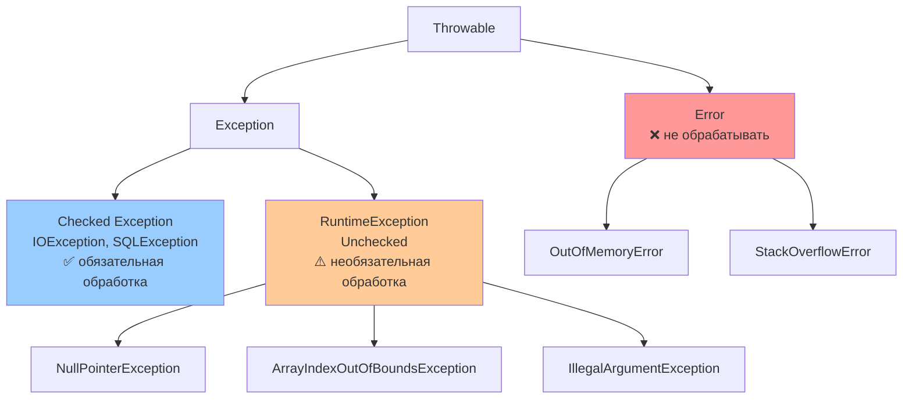

# Исключения в Java (Exception Handling)

> [!QUOTE] Суть
> **Исключение** — объект, представляющий ошибку или неожиданное событие во время выполнения. Нарушает нормальный поток программы. Checked исключения обязательны к обработке, Unchecked — на усмотрение разработчика. Используй `try-with-resources` вместо `finally` для ресурсов.

## 1. Иерархия исключений

Все исключения в Java наследуются от класса `Throwable`, который имеет два основных подкласса:

- **`Error`**: Представляет серьезные ошибки, связанные с JVM (например, `OutOfMemoryError`, `StackOverflowError`). Обычно их не обрабатывают, так как они указывают на проблемы, которые трудно или невозможно исправить.
- **`Exception`**: Представляет ошибки, которые можно обработать (например, `IOException`, `NullPointerException`).
### Подтипы исключений

1. **Проверяемые исключения (Checked Exceptions)**:
    - Наследуются от `Exception`, но не от `RuntimeException`.
    - Должны быть либо обработаны (`try-catch`), либо объявлены в сигнатуре метода (`throws`).
    - Примеры: `IOException`, `SQLException`, `ClassNotFoundException`.
2. **Непроверяемые исключения (Unchecked Exceptions)**:
    - Наследуются от `RuntimeException`.
    - Не требуют обязательной обработки или объявления.
    - Примеры: `NullPointerException`, `ArrayIndexOutOfBoundsException`, `IllegalArgumentException`.
3. **Ошибки (Errors)**:
    - Наследуются от `Error`.
    - Обычно не обрабатываются, так как связаны с критическими сбоями JVM.
    - Примеры: `OutOfMemoryError`, `VirtualMachineError`.
### Иерархия


## 3. Ключевые слова для работы с исключениями

Java предоставляет несколько ключевых слов для работы с исключениями:

- **`try`**: Определяет блок кода, в котором могут возникнуть исключения.
- **`catch`**: Перехватывает и обрабатывает исключения, возникшие в блоке `try`.
- **`finally`**: Выполняется всегда, независимо от того, было ли выброшено исключение.
- **`throw`**: Используется для явного выброса исключения.
- **`throws`**: Указывает в сигнатуре метода, какие проверяемые исключения он может выбросить.
### Пример базового использования

```java
import java.io.File;
import java.io.IOException;

public class ExceptionExample {
    public static void main(String[] args) {
        try {
            File file = new File("test.txt");
            if (!file.exists()) {
                throw new IOException("Файл не найден");
            }
            System.out.println("Файл существует");
        } catch (IOException e) {
            System.out.println("Ошибка: " + e.getMessage());
        } finally {
            System.out.println("Блок finally выполнен");
        }
    }
}
```

**Вывод** (если файл не существует):

```
Ошибка: Файл не найден
Блок finally выполнен
```
## 4. Типы обработки исключений

### 4.1. Перехват исключений (`try-catch`)

Блок `try` содержит код, который может выбросить исключение. Блок `catch` обрабатывает конкретный тип исключения.

```java
try {
    int[] array = new int[3];
    System.out.println(array[5]); // ArrayIndexOutOfBoundsException
} catch (ArrayIndexOutOfBoundsException e) {
    System.out.println("Ошибка индекса: " + e.getMessage());
}
```
### 4.2. Множественный `catch`

Можно перехватывать несколько типов исключений в одном `try`.

```java
try {
    String s = null;
    System.out.println(s.length()); // NullPointerException
    int[] array = new int[3];
    System.out.println(array[5]); // ArrayIndexOutOfBoundsException
} catch (NullPointerException e) {
    System.out.println("NPE: " + e.getMessage());
} catch (ArrayIndexOutOfBoundsException e) {
    System.out.println("Индекс вне границ: " + e.getMessage());
}
```
### 4.3. Общий `catch` (Java 7+)

Можно перехватывать несколько исключений в одном блоке `catch` с помощью `|`.

```java
try {
    String s = null;
    System.out.println(s.length());
    int[] array = new int[3];
    System.out.println(array[5]);
} catch (NullPointerException | ArrayIndexOutOfBoundsException e) {
    System.out.println("Ошибка: " + e.getMessage());
}
```
### 4.4. Блок `finally`

Выполняется всегда, даже если исключение не было выброшено или перехвачено.

```java
try {
    System.out.println("Операция с файлом");
    throw new IOException("Ошибка ввода-вывода");
} catch (IOException e) {
    System.out.println("Перехвачено: " + e.getMessage());
} finally {
    System.out.println("Закрытие ресурсов");
}
```

**Заметка**: `finally` часто используется для освобождения ресурсов (например, закрытие файлов), но с Java 7+ предпочтительнее использовать `try-with-resources`.
### 4.5. Try-with-Resources (Java 7+)

Автоматически закрывает ресурсы, реализующие интерфейс `AutoCloseable` (например, `FileInputStream`, `Connection`).

```java
try (FileInputStream fis = new FileInputStream("test.txt")) {
    int data = fis.read();
    System.out.println("Прочитано: " + data);
} catch (IOException e) {
    System.out.println("Ошибка: " + e.getMessage());
}
```

**Преимущества**:

- Упрощает закрытие ресурсов.
- Предотвращает утечки ресурсов.
- Более читаемый код.
### 4.6. Выброс исключений (`throw` и `throws`)

- **`throw`**: Явно выбрасывает исключение.
- **`throws`**: Указывает, какие проверяемые исключения может выбросить метод.

```java
public void readFile(String path) throws IOException {
    File file = new File(path);
    if (!file.exists()) {
        throw new IOException("Файл не найден: " + path);
    }
}
```
## 5. Создание пользовательских исключений

Вы можете создавать собственные исключения, унаследовав их от `Exception` (для проверяемых) или `RuntimeException` (для непроверяемых).
### Пример пользовательского исключения

```java
public class InsufficientFundsException extends Exception {
    public InsufficientFundsException(String message) {
        super(message);
    }
}

public class BankAccount {
    private double balance;

    public void withdraw(double amount) throws InsufficientFundsException {
        if (amount > balance) {
            throw new InsufficientFundsException("Недостаточно средств: " + amount);
        }
        balance -= amount;
    }
}
```

**Рекомендация**: Используйте пользовательские исключения для специфичных ошибок доменной логики.
## 6. Внутренняя реализация исключений

### 6.1. Как JVM обрабатывает исключения

- **Таблицы исключений**: Каждый метод в байт-коде содержит таблицу исключений, указывающую, какие блоки `try` соответствуют каким `catch` и `finally`.
- **Стек вызовов**: При выбросе исключения JVM ищет подходящий `catch` в стеке вызовов, начиная с текущего метода.
- **Производительность**: Выброс и перехват исключений — дорогостоящая операция, так как требует анализа стека и создания объектов `Throwable`.
### 6.2. Стек вызовов (`StackTrace`)

Каждое исключение содержит стек вызовов, доступный через `getStackTrace()` или `printStackTrace()`.

```java
try {
    throw new RuntimeException("Ошибка");
} catch (RuntimeException e) {
    e.printStackTrace();
}
```

**Вывод**:

```
java.lang.RuntimeException: Ошибка
    at ExceptionExample.main(ExceptionExample.java:10)
```
### 6.3. Причина исключения (Cause)

Исключения могут содержать причину (другое исключение), доступную через `getCause()`.

```java
try {
    throw new IOException("Ошибка ввода-вывода");
} catch (IOException e) {
    throw new RuntimeException("Не удалось обработать файл", e);
}
```
## 7. Производительность исключений

- **Выброс исключений**: Дорогостоящая операция из-за создания объекта `Throwable` и заполнения стека вызовов.
- **Перехват исключений**: Требует анализа таблиц исключений, что добавляет накладные расходы.
- **Try-with-Resources**: Уменьшает накладные расходы на управление ресурсами.
- **Множественный `catch`**: Упрощает код и минимизирует дублирование.

> [!WARNING] Ловушка: исключения вместо if-else
> Выброс исключения = создание `Throwable` + заполнение stacktrace — это **дорогая операция** (сотни ns). Не используй исключения для управления потоком выполнения в горячих путях.

```java
// ПЛОХО: исключения для контроля потока
for (int i = 0; i < 1000000; i++) {
    if (i % 2 == 0) throw new Exception("Чётное"); // Убивает производительность
}

// ХОРОШО: используй условие
if (i % 2 == 0) { /* обработка */ }
```
> [!WARNING] Ловушка: пустой catch — молчаливое поглощение ошибок
> Пустой `catch` скрывает ошибки и делает отладку невозможной. Всегда логируй или перебрасывай исключение. Это одна из самых опасных практик.

## 8. Подводные камни

1. **Игнорирование исключений**:
    
    ```java
    try {
        // Код
    } catch (Exception e) {
        // Пустой catch
    }
    ```
    
    **Решение**: Логируйте исключения или обрабатывайте их осмысленно.
    
2. **Перехват слишком общего исключения**:
    
    ```java
    try {
        // Код
    } catch (Exception e) {
        // Ловит все, включая RuntimeException
    }
    ```
    
    **Решение**: Перехватывайте конкретные исключения и используйте `Exception` только в крайнем случае.
    
3. **Пропуск `finally` или `try-with-resources`**:
    
    - Незакрытые ресурсы могут привести к утечкам.
    - **Решение**: Используйте `try-with-resources` для `AutoCloseable` ресурсов.
4. **Повторный выброс без причины**:
    
    ```java
    try {
        throw new IOException("Ошибка");
    } catch (IOException e) {
        throw new RuntimeException(); // Потеря оригинальной причины
    }
    ```
    
    **Решение**: Передавайте оригинальное исключение как причину (`new RuntimeException(e)`).
    
5. **Чрезмерное использование `throws`**:
    
    - Объявление множества исключений в сигнатуре метода усложняет API.
    - **Решение**: Оборачивайте низкоуровневые исключения в пользовательские.
## 9. Лучшие практики

1. **Используйте проверяемые исключения для восстанавливаемых ошибок**:
    - Например, `IOException` для операций с файлами.
2. **Используйте непроверяемые исключения для ошибок программирования**:
    - Например, `IllegalArgumentException` для некорректных параметров.
3. **Перехватывайте конкретные исключения**:
    - Ловите `IOException` вместо `Exception`, чтобы избежать скрытия ошибок.
4. **Используйте `try-with-resources`**:
    - Для автоматического закрытия ресурсов (файлы, соединения).
5. **Логируйте исключения**:
    
    ```java
    try {
        // Код
    } catch (IOException e) {
        Logger.getLogger("App").log(Level.SEVERE, "Ошибка", e);
    }
    ```
    
6. **Создавайте осмысленные пользовательские исключения**:
    - Используйте описательные сообщения и причины.
7. **Избегайте исключений для управления потоком**:
    - Исключения — это не замена `if-else`.
8. **Объединяйте обработку с помощью множественного `catch`**:
    - Упрощает код для похожих исключений.
9. **Добавляйте контекст в сообщения**:

    ```java
    throw new IOException("Не удалось открыть файл: " + fileName);
    ```
## 10. Пример: Комплексная обработка исключений

```java
import java.io.FileInputStream;
import java.io.IOException;
import java.util.logging.Level;
import java.util.logging.Logger;

public class FileProcessor {
    private static final Logger LOGGER = Logger.getLogger(FileProcessor.class.getName());

    public static class FileProcessingException extends Exception {
        public FileProcessingException(String message, Throwable cause) {
            super(message, cause);
        }
    }

    public void processFile(String path) throws FileProcessingException {
        try (FileInputStream fis = new FileInputStream(path)) {
            int data;
            while ((data = fis.read()) != -1) {
                System.out.write((char) data);
            }
        } catch (IOException e) {
            LOGGER.log(Level.SEVERE, "Ошибка обработки файла: " + path, e);
            throw new FileProcessingException("Не удалось обработать файл: " + path, e);
        } finally {
            System.out.println("Обработка завершена");
        }
    }

    public static void main(String[] args) {
        FileProcessor processor = new FileProcessor();
        try {
            processor.processFile("test.txt");
        } catch (FileProcessingException e) {
            System.out.println("Ошибка: " + e.getMessage());
            System.out.println("Причина: " + e.getCause());
        }
    }
}
```

**Вывод** (если файл не существует):

```
Ошибка: Не удалось обработать файл: test.txt
Причина: java.io.FileNotFoundException: test.txt (No such file or directory)
Обработка завершена
```
## 11. Исключения и многопоточность

В многопоточных приложениях исключения требуют особого внимания:

- **Перехват в потоках**:
    - Исключения, выброшенные в потоках, не передаются в вызывающий поток.
    - **Решение**: Используйте `ExecutorService` с `Future` или `CompletableFuture`.

```java
import java.util.concurrent.ExecutorService;
import java.util.concurrent.Executors;
import java.util.concurrent.Future;

public class ThreadExceptionExample {
    public static void main(String[] args) {
        ExecutorService executor = Executors.newFixedThreadPool(1);
        Future<?> future = executor.submit(() -> {
            throw new RuntimeException("Ошибка в потоке");
        });
        try {
            future.get(); // Получаем исключение
        } catch (Exception e) {
            System.out.println("Перехвачено: " + e.getCause());
        }
        executor.shutdown();
    }
}
```

- **Потокобезопасные ресурсы**:
    - Используйте `try-with-resources` для закрытия ресурсов в многопоточных приложениях.
## 12. Исключения и производительность JVM

- **Создание исключений**: Создание объекта `Throwable` включает заполнение стека вызовов, что дорого.
- **Оптимизация JVM**: Современные JVM оптимизируют обработку исключений, но частый выброс остается затратным.

## Связанные темы

- [[Java Input-Output]] — IOException в I/O операциях
- [[Java Serialization and Deserialization]] — исключения при сериализации
- [[ThreadPool, Future, Callable, Executors, CompletableFuture]] — ExecutionException, InterruptedException
- [[Корпоративная социальная сеть - микросервисная архитектура, выбор языка и идеи для вовлечённости|Корпоративная социальная сеть]] — обработка исключений в REST API микросервисов
- **Рекомендация**: Используйте профилировщики (например, VisualVM) для анализа влияния исключений на производительность.

---

## 13. Senior Insights

### 13.1. try-with-resources: что генерирует javac

Компилятор разворачивает `try (Resource r = ...)` в сложный `try-finally` с обработкой подавленных исключений. Это важно понимать при дебаге.

**Исходный код:**
```java
try (InputStream in = new FileInputStream("a.txt");
     OutputStream out = new FileOutputStream("b.txt")) {
    transfer(in, out);
}
```

**Что генерирует javac (псевдо-код):**
```java
InputStream in = new FileInputStream("a.txt");
Throwable $primaryExc = null;          // synthetic variable
try {
    OutputStream out = new FileOutputStream("b.txt");
    Throwable $primaryExc2 = null;
    try {
        transfer(in, out);
    } catch (Throwable t) {
        $primaryExc2 = t;              // запоминаем первичное исключение
        throw t;
    } finally {
        if (out != null) {
            if ($primaryExc2 != null) {
                try { out.close(); }
                catch (Throwable t) {
                    $primaryExc2.addSuppressed(t); // не теряем исключение close()
                }
            } else {
                out.close();           // если нет первичного — бросаем из close()
            }
        }
    }
} catch (Throwable t) {
    $primaryExc = t;
    throw t;
} finally {
    // то же самое для in
}
```

**Порядок закрытия:** LIFO (last opened — first closed). `out` закрывается первым, потом `in`.

### 13.2. Suppressed Exceptions

Suppressed исключения возникают когда `close()` бросает исключение во время разворачивания стека.

```java
class BrokenResource implements AutoCloseable {
    @Override
    public void close() throws Exception {
        throw new Exception("close() failed");
    }
}

try (BrokenResource r = new BrokenResource()) {
    throw new RuntimeException("primary"); // первичное исключение
}
// RuntimeException("primary") будет выброшено
// Exception("close() failed") будет подавлено и доступно через:
// e.getSuppressed()[0]
```

**Получение подавленных исключений:**
```java
try {
    // ...
} catch (RuntimeException e) {
    System.out.println("Primary: " + e.getMessage());
    for (Throwable suppressed : e.getSuppressed()) {
        System.out.println("Suppressed: " + suppressed.getMessage());
    }
}
```

> [!WARNING] Ловушка: ручной finally скрывает исключение close()
> ```java
> Resource r = new Resource();
> try {
>     doWork();
> } finally {
>     r.close(); // если close() бросает — исключение из doWork() ТЕРЯЕТСЯ!
> }
> // Используй try-with-resources — там addSuppressed() сохранит оба
> ```

### 13.3. Exception chaining — внутренняя механика

**`initCause` vs конструктор:**
```java
// Через конструктор (предпочтительно):
throw new ServiceException("DB error", cause);  // super(message, cause)

// Через initCause (только если нет конструктора с cause):
ServiceException ex = new ServiceException("DB error");
ex.initCause(cause);  // можно вызвать ТОЛЬКО ОДИН РАЗ, иначе IllegalStateException
throw ex;
```

**Внутри Throwable:**
```java
// Throwable хранит:
private Throwable cause = this;  // this = "cause not set"
// После initCause(t): cause = t
// После initCause(null): cause = null (явный "нет причины")

// getCause() возвращает null если cause == this (не было вызова)
```

**Цепочка при перебросе:**
```java
// ПЛОХО — теряем оригинальный стек:
try {
    db.query();
} catch (SQLException e) {
    throw new ServiceException("DB failed"); // ← нет cause!
}

// ХОРОШО — сохраняем причину и добавляем контекст:
} catch (SQLException e) {
    throw new ServiceException("DB failed for user=" + userId, e);
}

// ХОРОШО — перебросить с обёрткой (для API, скрывающих детали реализации):
} catch (SQLException e) {
    throw new DataAccessException("Repository layer failure", e);
}
```

### 13.4. Производительность: fillInStackTrace()

Создание исключения — это не просто `new Object()`. Дорогой шаг — `fillInStackTrace()`:

```java
// Вызывается в конструкторе Throwable:
public Throwable() {
    fillInStackTrace(); // ← нативный метод, обходит весь стек вызовов
}
```

**Реальные числа (JMH, warm JVM):**
| Операция | Время |
|---|---|
| `new Object()` | ~5 нс |
| `new Exception()` (стек 5 фреймов) | ~500 нс |
| `new Exception()` (стек 50 фреймов) | ~5000 нс |
| `throw/catch` уже созданного | ~50 нс |
| Первый `throw` (интерпретатор) | ~100 мкс |

**Оптимизация JVM — OmitStackTraceInFastThrow:**
```
JIT оптимизирует часто бросаемые исключения:
NPE/AIOOB/ClassCast/StackOverflow → JVM начинает бросать
singleton-исключение БЕЗ stack trace (нулевой overhead)

-XX:-OmitStackTraceInFastThrow — отключить оптимизацию (для отладки)
```

```java
// Обнаруживаешь по пустому стеку в логах:
java.lang.NullPointerException
    (no stack trace — это JVM оптимизация!)

// → добавь -XX:-OmitStackTraceInFastThrow при воспроизведении
```

**Трюк — переопределить fillInStackTrace для cheap exceptions:**
```java
// Для исключений, используемых как control flow (редко оправдано):
public class FastException extends RuntimeException {
    public FastException(String message) {
        super(message, null, true, false); // 4-й параметр: writableStackTrace=false
    }

    @Override
    public synchronized Throwable fillInStackTrace() {
        return this; // no-op
    }
}
// Производительность: ~5 нс вместо ~500 нс
// Применение: Vavr's ControlThrowable, Scala BreakControl
```

### 13.5. Custom Exceptions в микросервисах

**Иерархия для API:**
```java
// Базовое для доменных ошибок:
public abstract class DomainException extends RuntimeException {
    private final ErrorCode code;
    private final Map<String, Object> context;

    protected DomainException(ErrorCode code, String message, Map<String, Object> ctx) {
        super(message);
        this.code = code;
        this.context = Map.copyOf(ctx); // иммутабельность
    }

    protected DomainException(ErrorCode code, String message, Throwable cause) {
        super(message, cause);
        this.code = code;
        this.context = Map.of();
    }
}

// Конкретные типы:
public class UserNotFoundException extends DomainException {
    public UserNotFoundException(long userId) {
        super(ErrorCode.USER_NOT_FOUND,
              "User not found: " + userId,
              Map.of("userId", userId));
    }
}

public class InsufficientBalanceException extends DomainException {
    public InsufficientBalanceException(BigDecimal required, BigDecimal available) {
        super(ErrorCode.INSUFFICIENT_BALANCE,
              "Required: " + required + ", available: " + available,
              Map.of("required", required, "available", available));
    }
}
```

**Перехват в Spring REST:**
```java
@RestControllerAdvice
public class GlobalExceptionHandler {

    @ExceptionHandler(DomainException.class)
    public ResponseEntity<ErrorResponse> handleDomain(DomainException ex) {
        return ResponseEntity
            .status(ex.getCode().getHttpStatus())
            .body(new ErrorResponse(ex.getCode(), ex.getMessage(), ex.getContext()));
    }

    @ExceptionHandler(Exception.class)
    public ResponseEntity<ErrorResponse> handleUnexpected(Exception ex) {
        log.error("Unexpected error", ex); // ← логируем с полным стеком
        return ResponseEntity.internalServerError()
            .body(new ErrorResponse(ErrorCode.INTERNAL_ERROR, "Internal server error", Map.of()));
    }
}
```

> [!INFO] Правила для Senior
> 1. **Checked exceptions** — только на границах системы (I/O, внешние API), где вызывающий должен обработать
> 2. **Unchecked** — для нарушения контракта (неверные данные, нарушение инварианта)
> 3. **Всегда добавляй cause** при перебросе — потеря стека = часы отладки
> 4. **Не лови Throwable** — `Error` сигнализирует о неисправимом состоянии JVM
> 5. **InterruptedException** — всегда восстанавливай флаг: `Thread.currentThread().interrupt()`