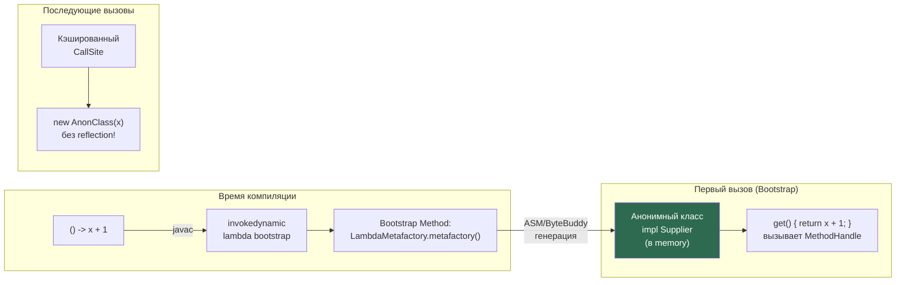

# MethodHandle & LambdaMetafactory

> [!QUOTE] Суть
> **MethodHandle** — типобезопасный "указатель на метод" в JVM. Быстрее рефлексии (JIT инлайнит). **LambdaMetafactory** + `invokedynamic` — вот как реализованы лямбды: не анонимный класс, а динамически генерируемая реализация функционального интерфейса.

> MethodHandle — "функциональный указатель" JVM. Быстрее рефлексии, основа лямбд, Stream API, invokedynamic. Senior понимает как работают лямбды под капотом.

## 1. Проблема: Reflection vs MethodHandle

```java
// Reflection: медленно (до Java 9), небезопасно
Method m = String.class.getMethod("length");
m.setAccessible(true);
int len = (int) m.invoke("hello"); // boxing/unboxing, checks каждый раз

// MethodHandle: быстро, типобезопасно (JIT инлайнит!)
MethodHandle mh = MethodHandles.lookup()
    .findVirtual(String.class, "length", MethodType.methodType(int.class));
int len = (int) mh.invoke("hello"); // JIT может инлайнить как прямой вызов!
```

### Сравнение производительности

| Способ | Overhead | JIT Inlining | Безопасность типов |
|---|---|---|---|
| Прямой вызов | 0 | Да | Компилятор |
| MethodHandle (invokeExact) | ~0% | Да (после прогрева) | Runtime |
| MethodHandle (invoke) | ~5% | Частично | Runtime + boxing |
| Reflection (с setAccessible) | ~50-200% | Нет | Runtime |
| Reflection (без setAccessible) | ~500%+ | Нет | Runtime |

---

## 2. MethodHandles.Lookup — контекст доступа

```java
// Lookup — "токен доступа": инкапсулирует права вызывающего класса
MethodHandles.Lookup lookup = MethodHandles.lookup(); // текущий класс
MethodHandles.Lookup publicLookup = MethodHandles.publicLookup(); // только public API

// Java 9+: приватный lookup через другой класс (для фреймворков)
MethodHandles.Lookup privateLookup = MethodHandles.privateLookupIn(
    TargetClass.class,
    MethodHandles.lookup() // caller должен иметь доступ
);
// privateLookup теперь может искать private методы TargetClass
```

### 2.1. Все виды findXxx

```java
MethodHandles.Lookup lookup = MethodHandles.lookup();

// findVirtual — нестатический метод (instance method)
MethodHandle toUpper = lookup.findVirtual(
    String.class,
    "toUpperCase",
    MethodType.methodType(String.class) // return type (no args)
);
String result = (String) toUpper.invoke("hello"); // "HELLO"

// findStatic — статический метод
MethodHandle parseInt = lookup.findStatic(
    Integer.class,
    "parseInt",
    MethodType.methodType(int.class, String.class) // (arg1Type) -> returnType
);
int n = (int) parseInt.invoke("42"); // 42

// findConstructor — конструктор
MethodHandle ctor = lookup.findConstructor(
    StringBuilder.class,
    MethodType.methodType(void.class, String.class) // конструктор всегда void
);
StringBuilder sb = (StringBuilder) ctor.invoke("initial");

// findSpecial — super.method() или private метод (только тот же класс)
MethodHandle superToString = lookup.findSpecial(
    Object.class, "toString",
    MethodType.methodType(String.class),
    MyClass.class  // specialCaller
);

// findGetter/findSetter — доступ к полям
MethodHandle fieldGetter = lookup.findGetter(MyClass.class, "value", int.class);
MethodHandle fieldSetter = lookup.findSetter(MyClass.class, "value", int.class);

// findStaticGetter/findStaticSetter — статические поля
MethodHandle staticGetter = lookup.findStaticGetter(System.class, "out", PrintStream.class);
```

---

## 3. MethodType — система типов

```java
// MethodType описывает сигнатуру: (параметры) → возвращаемый тип
MethodType mt1 = MethodType.methodType(void.class);              // ()V
MethodType mt2 = MethodType.methodType(int.class, String.class); // (String)I
MethodType mt3 = MethodType.methodType(
    String.class, int.class, char.class);                        // (IC)String

// invokeExact — точное совпадение типов (САМЫЙ БЫСТРЫЙ!)
MethodHandle mh = lookup.findVirtual(String.class, "charAt",
    MethodType.methodType(char.class, int.class));
char c = (char) mh.invokeExact("hello", 1); // 'e' — точный тип!
// Ошибка: mh.invokeExact("hello", 1L) — WrongMethodTypeException!

// invoke — автоматические конверсии (boxing, narrowing/widening)
char c2 = (char) mh.invoke("hello", Integer.valueOf(1)); // работает с Integer
```

---

## 4. Комбинаторы MethodHandle

```java
MethodHandle strlen = lookup.findVirtual(String.class, "length",
    MethodType.methodType(int.class));

// 4.1. bindTo — частичное применение (currying)
MethodHandle strlenOf = strlen.bindTo("fixed string");
int len = (int) strlenOf.invoke(); // "fixed string".length()

// 4.2. asCollector — собирает trailing аргументы в массив
MethodHandle printArgs = lookup.findStatic(Arrays.class, "toString",
    MethodType.methodType(String.class, Object[].class));
MethodHandle spreadPrint = printArgs.asCollector(Object[].class, 3);
String s = (String) spreadPrint.invoke("a", "b", "c"); // [a, b, c]

// 4.3. asSpreader — разворачивает массив в аргументы
MethodHandle spread = strlen.asSpreader(Object[].class, 1);
int len2 = (int) spread.invoke(new Object[]{"hello"}); // 5

// 4.4. filterReturnValue — преобразование результата
MethodHandle intToStr = lookup.findStatic(Integer.class, "toString",
    MethodType.methodType(String.class, int.class));
MethodHandle strlenAsStr = MethodHandles.filterReturnValue(strlen, intToStr);
String lenStr = (String) strlenAsStr.invoke("hello"); // "5"

// 4.5. filterArguments — преобразование аргументов
MethodHandle trimmer = lookup.findVirtual(String.class, "trim",
    MethodType.methodType(String.class));
MethodHandle filteredStrlen = MethodHandles.filterArguments(strlen, 0, trimmer);
int trimmedLen = (int) filteredStrlen.invoke("  hi  "); // 2 (не 6)

// 4.6. guardWithTest — условный dispatch
MethodHandle isNull = lookup.findStatic(Objects.class, "isNull",
    MethodType.methodType(boolean.class, Object.class));
// ... сложные комбинации ...
```

---

## 5. VarHandle — замена Unsafe

VarHandle (Java 9+) — типобезопасная альтернатива `sun.misc.Unsafe` для атомарных операций.

```java
import java.lang.invoke.*;

public class AtomicCounter {
    private volatile int count = 0;

    // VarHandle для поля 'count':
    private static final VarHandle COUNT;
    static {
        try {
            COUNT = MethodHandles.lookup()
                .findVarHandle(AtomicCounter.class, "count", int.class);
        } catch (ReflectiveOperationException e) {
            throw new ExceptionInInitializerError(e);
        }
    }

    // Атомарный инкремент (эквивалент Unsafe.getAndAddInt):
    public int getAndIncrement() {
        return (int) COUNT.getAndAdd(this, 1);
    }

    // CAS операция:
    public boolean compareAndSet(int expected, int update) {
        return COUNT.compareAndSet(this, expected, update);
    }

    // Различные memory ordering:
    public int getPlain() { return (int) COUNT.get(this); }           // нет барьера
    public int getOpaque() { return (int) COUNT.getOpaque(this); }    // нет reordering для этого access
    public int getAcquire() { return (int) COUNT.getAcquire(this); }  // LoadLoad + LoadStore
    public void setRelease(int v) { COUNT.setRelease(this, v); }      // StoreStore

    // Vs volatile:
    public int getVolatile() { return count; }  // полный барьер (дороже)
}
```

### VarHandle для массива

```java
// Атомарный доступ к элементам массива:
int[] array = new int[16];
VarHandle arrayHandle = MethodHandles.arrayElementVarHandle(int[].class);

arrayHandle.setVolatile(array, 5, 42);           // array[5] = 42 (volatile)
int val = (int) arrayHandle.getVolatile(array, 5); // volatile read
boolean success = arrayHandle.compareAndSet(array, 5, 42, 100); // CAS

// Это основа java.util.concurrent.atomic.AtomicIntegerArray (Java 9+)!
```

---

## 6. LambdaMetafactory — как работают лямбды



### 6.1. Что делает компилятор с лямбдой

```java
// Ваш код:
Supplier<Integer> supplier = () -> 42;

// javac компилирует в (упрощённо):
// 1. Создаёт приватный статический метод в классе:
private static Integer lambda$0() { return 42; }

// 2. Вставляет invokedynamic инструкцию:
// invokedynamic "get":()Ljava/util/function/Supplier;
//   Bootstrap: LambdaMetafactory.metafactory(
//     Lookup,           // текущий класс
//     "get",            // имя SAM метода
//     MethodType,       // тип callsite: ()Supplier
//     samMethodType,    // тип SAM: ()Object
//     implMethod,       // MethodHandle → lambda$0
//     instantiatedType  // ()Integer
//   )
```

### 6.2. LambdaMetafactory программно (для фреймворков)

```java
import java.lang.invoke.*;
import java.util.function.*;

// Создать Supplier<String> из метода без рефлексии:
MethodHandles.Lookup lookup = MethodHandles.lookup();

MethodHandle target = lookup.findVirtual(String.class, "toLowerCase",
    MethodType.methodType(String.class));

// Через LambdaMetafactory создаём Function<String, String>:
CallSite callSite = LambdaMetafactory.metafactory(
    lookup,
    "apply",                                              // SAM method name
    MethodType.methodType(Function.class),                // factory type: () → Function
    MethodType.methodType(Object.class, Object.class),    // SAM erased type: (Object)Object
    target,                                               // implementation MethodHandle
    MethodType.methodType(String.class, String.class)    // SAM instantiated type
);

Function<String, String> toLower = (Function<String, String>) callSite.getTarget().invoke();

// Теперь toLower.apply("HELLO") вызывает "HELLO".toLowerCase()
// Это БЫСТРЕЕ рефлексии — JIT видит это как прямой вызов!
System.out.println(toLower.apply("HELLO")); // "hello"
```

### 6.3. Применение в фреймворках: быстрый доступ к полям

```java
// Получить getter как Function<Object, Object> без рефлексии:
public static Function<Object, Object> createGetter(Field field) throws Throwable {
    MethodHandles.Lookup lookup = MethodHandles.privateLookupIn(
        field.getDeclaringClass(), MethodHandles.lookup());

    MethodHandle getter = lookup.unreflectGetter(field);

    CallSite callSite = LambdaMetafactory.metafactory(
        lookup,
        "apply",
        MethodType.methodType(Function.class),
        MethodType.methodType(Object.class, Object.class),
        getter,
        MethodType.methodType(field.getType(), field.getDeclaringClass())
    );

    return (Function<Object, Object>) callSite.getTarget().invoke();
}

// Использование (в Jackson-like сериализаторе):
Field nameField = User.class.getDeclaredField("name");
Function<Object, Object> nameGetter = createGetter(nameField);

User user = new User("Alice");
String name = (String) nameGetter.apply(user); // "Alice" — без reflection overhead!
```

---

## 7. invokedynamic bytecode

```java
// invokedynamic — единственная инструкция JVM без фиксированного receiver
// Используется для: лямбд, String concatenation (Java 9+), records, switch pattern matching

// Пример: String + в Java 9+ больше не StringBuilder!
// "Hello " + name + "!"
// Компилируется в:
// invokedynamic "makeConcatWithConstants":(String;)String
//   Bootstrap: StringConcatFactory.makeConcatWithConstants(...)
// JVM генерирует оптимальный код для конкатенации — лучше чем StringBuilder!

// Просмотр invokedynamic в байт-коде:
// javap -verbose -p MyClass.class | grep -A5 invokedynamic
```

---

## Senior Insights

### Bridge Methods и MethodHandle

```java
// Bridge methods (синтетические, генерирует javac) тоже доступны через MethodHandle
// Но нужно знать их сигнатуру (стёртые типы):

interface Processor<T> { T process(T input); }
class StringProcessor implements Processor<String> {
    public String process(String s) { return s.toUpperCase(); }
    // Bridge (синтетический): public Object process(Object o) { return process((String)o); }
}

// Найти bridge method через reflection:
Method[] methods = StringProcessor.class.getDeclaredMethods();
for (Method m : methods) {
    if (m.isBridge()) {
        System.out.println("Bridge: " + m); // Object process(Object)
    }
}

// Через MethodHandle (нужно указать bridge сигнатуру):
MethodHandle bridge = lookup.findVirtual(StringProcessor.class, "process",
    MethodType.methodType(Object.class, Object.class)); // стёртый тип!
```

### MethodHandle как замена Reflection в Spring/Hibernate

```java
// Hibernate 6+ использует MethodHandle вместо Field.get() для доступа к полям:
// Было (Reflection): field.get(entity) → expensive checks, boxing
// Стало (MethodHandle): getter.invokeExact(entity) → JIT-inlineable!

// Spring Framework 6 также мигрирует критические пути на MethodHandle
// Результат: ~30-50% ускорение для высоконагруженных операций маппинга
```

---

## Senior Interview Q&A

**Q1: Чем invokeExact отличается от invoke и когда использовать каждый?**

> `invokeExact` требует ТОЧНОГО совпадения всех типов (параметры и возвращаемый тип) — бросает `WrongMethodTypeException` при любом несовпадении, включая `int` vs `Integer`. Зато JIT компилирует его в прямой вызов метода без boxing. `invoke` делает автоматические конверсии: widening, boxing/unboxing, reference narrowing — удобнее, но с небольшим overhead. Правило: в performance-critical коде всегда `invokeExact` с точными типами. В общем фреймворкном коде — `invoke` для удобства.

**Q2: Как работает invokedynamic и почему String concatenation стал быстрее в Java 9?**

> До Java 9: `"Hello " + name` компилировался в `new StringBuilder().append("Hello ").append(name).toString()` — фиксированный bytecode, JIT оптимизирует как может. Java 9+: `invokedynamic` с bootstrap методом `StringConcatFactory.makeConcatWithConstants()`. При первом выполнении JVM генерирует оптимальный нативный код для конкретной конкатенации (знает количество и типы аргументов). Это позволяет: использовать `VarHandle`-based подход без StringBuilder, аллоцировать результирующий массив правильного размера сразу (нет resize!), применять специализации для примитивных типов. Benchmark: Java 9+ строковая конкатенация на 15-30% быстрее.

**Q3: Почему LambdaMetafactory генерирует анонимный класс, а не просто вызывает MethodHandle?**

> Лямбда должна реализовывать функциональный интерфейс (Supplier, Function, etc.) — конкретный Java-тип, который можно передавать, хранить, вызывать через `apply()`/`get()`. LambdaMetafactory генерирует минимальный анонимный класс (через ASM) который: (1) реализует нужный интерфейс; (2) в своём методе вызывает сохранённый MethodHandle. Этот класс кэшируется в CallSite — последующие вызовы не генерируют новый класс. JIT видит стабильный тип → может инлайнить через де-виртуализацию. Альтернатива (MethodHandle напрямую) не работает с generic API вроде `List.removeIf(Predicate)`.

**Q4: Что такое VarHandle memory ordering и когда использовать getOpaque/getAcquire?**

> VarHandle предоставляет 4 уровня видимости: (1) `plain` — без барьеров, только для однопоточного кода; (2) `opaque` — нет переупорядочивания для конкретной переменной, но нет "happens-before" с другими операциями; (3) `acquire`/`release` — частичные барьеры: acquire = LoadLoad+LoadStore после чтения, release = StoreStore+StoreLoad перед записью — "lock-free lock" семантика; (4) `volatile` — полный барьер с обеих сторон. Правило: `acquire`/`release` для lock-free алгоритмов (spinlocks, queues), `opaque` для progress indicators (не нужна visibility другим потокам), `volatile` только когда нужна полная synchronization. Главная ценность: гибкость без `Unsafe`.

**Q5: Как LambdaMetafactory используется для создания быстрых сериализаторов/десериализаторов?**

> Традиционный Jackson при первом вызове использует reflection для доступа к полям. Для горячих типов можно создать LambdaMetafactory-based getter/setter: (1) получаем `MethodHandle` для getter через `privateLookupIn().findVirtual()`; (2) `LambdaMetafactory.metafactory()` генерирует `Function<Entity, Object>` реализующую вызов этого getter; (3) кэшируем `Function` в HashMap по имени поля. При сериализации: `getterMap.get("name").apply(entity)` вместо `nameField.get(entity)`. JIT видит стабильный тип `Function` → инлайнит → производительность как у прямого `entity.getName()`. Именно так работает современный Jackson 2.12+ с `--enable-preview` и Kryo 5.x.

## Связанные темы

- [[Java Reflection API]] — классический Reflection vs MethodHandle
- [[CAS и Unsafe]] — Unsafe vs VarHandle
- [[Java Generic]] — type erasure, bridge methods
- [[JIT Compiler & Optimizations]] — инлайнинг MethodHandle
- [[Java Agents & Instrumentation API]] — инструментирование через MethodHandle
