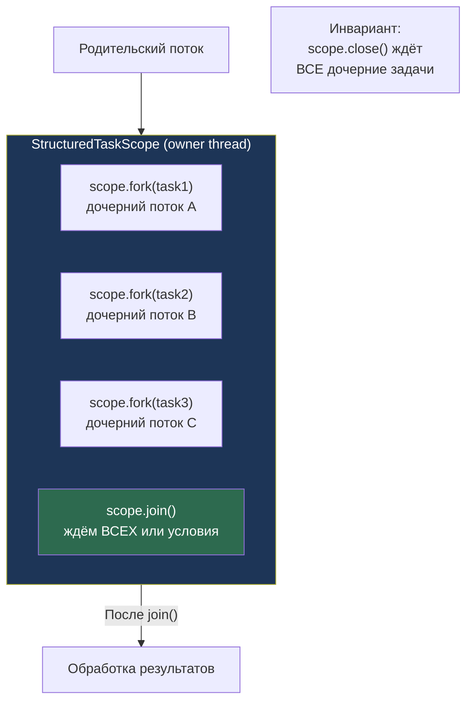

# Structured Concurrency (Java 21+)

> [!QUOTE] Суть
> **Structured Concurrency** (Java 21+, JEP 453) — параллельные задачи живут внутри try-with-resources scope. `StructuredTaskScope`: когда scope закрывается — все дочерние задачи автоматически отменяются. Предсказуемое время жизни, без утечек потоков.

> Structured Concurrency превращает параллельное выполнение задач в структурированную операцию с предсказуемым временем жизни, автоматической отменой и чистой обработкой ошибок — как функция вместо callback hell.

## 1. Проблема: Неструктурированная конкурентность

```java
// BAD: CompletableFuture — трудно управлять ресурсами и ошибками
public UserProfile getProfile(long userId) {
    CompletableFuture<User> userFuture = CompletableFuture
        .supplyAsync(() -> userService.findById(userId));
    CompletableFuture<List<Order>> ordersFuture = CompletableFuture
        .supplyAsync(() -> orderService.findByUser(userId));

    try {
        User user = userFuture.get(5, TimeUnit.SECONDS);
        List<Order> orders = ordersFuture.get(5, TimeUnit.SECONDS);
        return new UserProfile(user, orders);
    } catch (Exception e) {
        // ordersFuture всё ещё работает даже если userFuture упал!
        // Утечка потоков — нет автоматической отмены
        throw new RuntimeException(e);
    }
}
```

**Проблемы:**
- Нет гарантии отмены при ошибке
- Жизненный цикл задач размыт
- Трудно отлаживать (потоки "летают" где угодно)
- Exception handling сложный

---

## 2. StructuredTaskScope — архитектура



**Ключевой инвариант:** `StructuredTaskScope.close()` (через try-with-resources) **гарантирует**, что все дочерние задачи завершены до выхода из scope. Никаких утечек потоков.

---

## 3. ShutdownOnFailure — "все или ничего"

```java
import java.util.concurrent.StructuredTaskScope;

public UserProfile getProfile(long userId) throws InterruptedException, ExecutionException {
    try (var scope = new StructuredTaskScope.ShutdownOnFailure()) {

        // fork() запускает виртуальный поток немедленно
        StructuredTaskScope.Subtask<User> userTask =
            scope.fork(() -> userService.findById(userId));

        StructuredTaskScope.Subtask<List<Order>> ordersTask =
            scope.fork(() -> orderService.findByUser(userId));

        StructuredTaskScope.Subtask<List<Address>> addressTask =
            scope.fork(() -> addressService.findByUser(userId));

        // Ждём ВСЕ задачи ИЛИ первую ошибку:
        scope.join()           // блокируем до завершения
             .throwIfFailed(); // бросаем если любая задача упала

        // Сюда приходим только если ВСЕ задачи успешны:
        return new UserProfile(
            userTask.get(),    // гарантированно готово
            ordersTask.get(),
            addressTask.get()
        );

    } // close() отменяет оставшиеся задачи и ждёт их завершения
}
```

**Что происходит при ошибке:**
1. `userService.findById()` бросает исключение
2. `ShutdownOnFailure` немедленно отменяет все оставшиеся задачи (interrupt)
3. `join()` возвращает
4. `throwIfFailed()` бросает первое исключение
5. `close()` ждёт отмены оставшихся задач

---

## 4. ShutdownOnSuccess — "первый победитель"

```java
public String findFastestSource(String query) throws InterruptedException, ExecutionException {
    try (var scope = new StructuredTaskScope.ShutdownOnSuccess<String>()) {

        // Запрашиваем несколько источников параллельно:
        scope.fork(() -> primaryDatabase.search(query));
        scope.fork(() -> cacheService.search(query));
        scope.fork(() -> searchIndex.search(query));

        // Ждём ПЕРВЫЙ успешный результат:
        scope.join();

        return scope.result(); // результат первой успешной задачи
        // Остальные задачи — автоматически отменены!
    }
}
```

### Timeout с StructuredTaskScope

```java
public UserProfile getProfileWithTimeout(long userId) throws Exception {
    try (var scope = new StructuredTaskScope.ShutdownOnFailure()) {
        var userTask = scope.fork(() -> userService.findById(userId));
        var ordersTask = scope.fork(() -> orderService.findByUser(userId));

        // Timeout: если не завершились за 3 секунды — отменяем всё
        scope.joinUntil(Instant.now().plusSeconds(3)); // throws if timeout

        scope.throwIfFailed(); // если timeout → FailedException

        return new UserProfile(userTask.get(), ordersTask.get());
    }
}
```

---

## 5. Subtask состояния

```java
try (var scope = new StructuredTaskScope.ShutdownOnFailure()) {
    var task = scope.fork(() -> riskyOperation());
    scope.join();

    // Проверка состояния:
    switch (task.state()) {
        case SUCCESS -> {
            Object result = task.get(); // безопасно вызывать только при SUCCESS
        }
        case FAILED -> {
            Throwable ex = task.exception(); // исключение задачи
        }
        case UNAVAILABLE -> {
            // Задача была отменена (ShutdownOnFailure из-за другой задачи)
        }
    }
}
```

---

## 6. Кастомный StructuredTaskScope

```java
// Пример: "Кворум" — успех если минимум N из M задач успешны
public class QuorumScope<T> extends StructuredTaskScope<T> {
    private final int quorum;
    private final List<T> results = new CopyOnWriteArrayList<>();
    private final List<Throwable> exceptions = new CopyOnWriteArrayList<>();

    QuorumScope(int quorum) {
        this.quorum = quorum;
    }

    @Override
    protected void handleComplete(Subtask<? extends T> task) {
        switch (task.state()) {
            case SUCCESS -> {
                results.add(task.get());
                if (results.size() >= quorum) {
                    shutdown(); // достигли кворума — останавливаем
                }
            }
            case FAILED -> {
                exceptions.add(task.exception());
            }
        }
    }

    List<T> results() throws ExecutionException {
        ensureOwnerAndJoined();
        if (results.size() < quorum) {
            throw new ExecutionException("Quorum not reached",
                exceptions.isEmpty() ? null : exceptions.get(0));
        }
        return List.copyOf(results);
    }
}

// Использование:
try (var scope = new QuorumScope<String>(2)) {
    scope.fork(() -> replica1.read(key));
    scope.fork(() -> replica2.read(key));
    scope.fork(() -> replica3.read(key));

    scope.join();
    List<String> quorumResults = scope.results(); // минимум 2 успешных
}
```

---

## 7. Интеграция со Scoped Values

```java
static final ScopedValue<TraceContext> TRACE = ScopedValue.newInstance();
static final ScopedValue<User> CURRENT_USER = ScopedValue.newInstance();

public void handleRequest(TraceContext ctx, User user) throws Exception {
    ScopedValue.where(TRACE, ctx)
               .where(CURRENT_USER, user)
               .run(() -> {
                   try (var scope = new StructuredTaskScope.ShutdownOnFailure()) {
                       // Все дочерние задачи автоматически наследуют TRACE и CURRENT_USER!
                       scope.fork(() -> {
                           log("DB query for: " + CURRENT_USER.get().name()); // работает!
                           return db.query(TRACE.get().traceId());
                       });
                       scope.fork(() -> {
                           log("Cache lookup, trace: " + TRACE.get().traceId()); // работает!
                           return cache.get(CURRENT_USER.get().id());
                       });

                       scope.join().throwIfFailed();
                   } catch (Exception e) {
                       throw new RuntimeException(e);
                   }
               });
}
```

---

## 8. Structured Concurrency vs CompletableFuture

| Характеристика | CompletableFuture | StructuredTaskScope |
|---|---|---|
| Отмена при ошибке | Ручная | Автоматическая |
| Утечки потоков | Возможны | Невозможны (scope) |
| Жизненный цикл | Размытый | Чёткий (try-with-resources) |
| Exception handling | Сложный | Прямой (`throwIfFailed`) |
| Отладка | Сложная (callback chains) | Простая (структура = код) |
| Scoped Values | Нет наследования | Автоматическое наследование |
| Thread type | Platform/Virtual | Virtual (рекомендуется) |
| Java версия | Java 8+ | Java 21+ |
| Паттерн "первый выигрывает" | `anyOf()` (без отмены остальных) | `ShutdownOnSuccess` (с отменой) |

### Когда ещё использовать CompletableFuture

```java
// CompletableFuture лучше для:
// 1. Длинные цепочки трансформаций (pipeline):
CompletableFuture.supplyAsync(this::fetchData)
    .thenApply(this::transform)
    .thenCompose(this::saveToDb)
    .thenAccept(this::notifyUser);

// 2. Взаимодействие с существующим async API:
someAsyncLibrary.fetchAsync() // возвращает CompletableFuture
    .thenApply(result -> ...);

// 3. Java < 21
```

---

## 9. Практический паттерн: Fan-out/Fan-in

```java
// Обращение к N сервисам, агрегация результатов:
public AggregatedReport buildReport(List<Long> userIds) throws Exception {
    List<UserStats> allStats = new ArrayList<>();

    try (var scope = new StructuredTaskScope.ShutdownOnFailure()) {
        List<StructuredTaskScope.Subtask<UserStats>> tasks = userIds.stream()
            .map(id -> scope.fork(() -> statsService.getStats(id)))
            .toList();

        scope.join().throwIfFailed();

        // Все задачи успешны:
        allStats = tasks.stream()
            .map(StructuredTaskScope.Subtask::get)
            .toList();
    }

    return aggregator.aggregate(allStats);
}
```

---

## Senior Insights

### Structured Concurrency и виртуальные потоки — синергия

```java
// Виртуальные потоки + Structured Concurrency = идеальная пара
// НИКОГДА не используйте platform threads с StructuredTaskScope для I/O!

// BAD: Platform threads (ограничено системными ресурсами)
Thread.ofPlatform().factory(); // default для StructuredTaskScope? Нет!

// По умолчанию StructuredTaskScope использует виртуальные потоки:
// scope.fork(task) → Thread.ofVirtual().start(task)

// Один виртуальный поток = ~2KB памяти (vs ~1MB для platform thread)
// 10000 одновременных задач = 20MB vs 10GB RAM — вот почему это важно!
```

### Стектрейс в Structured Concurrency

```java
// Одно из ключевых преимуществ: понятные стектрейсы!
// CompletableFuture:
// Exception: null
//   at ForkJoinPool.commonPool-worker-1
//   ... 15 строк ForkJoin внутренностей ...
//   at lambda$0 (MyService.java:42)

// StructuredTaskScope:
// Exception: Connection refused
//   at UserService.findById (UserService.java:15)     ← СРАЗУ видно!
//   at MyService.lambda$getProfile$0 (MyService.java:22)
//   at StructuredTaskScope.fork (...)
//   at MyService.getProfile (MyService.java:20)       ← и caller!
// Виртуальный поток хранит полный стек от fork() до ошибки!
```

---

## Senior Interview Q&A

**Q1: Как StructuredTaskScope гарантирует отсутствие утечек потоков?**

> `StructuredTaskScope` реализует `AutoCloseable`. При вызове `close()` (явно или через try-with-resources): (1) вызывается `shutdown()` — сигнал всем дочерним задачам о необходимости остановки; (2) interrupt-ится каждый дочерний поток; (3) `close()` блокируется пока **все** дочерние виртуальные потоки не завершатся. Это структурный инвариант: scope живёт дольше чем все его дочерние задачи. Невозможно "потерять" поток — он всегда завершится до выхода из scope блока. В отличие от `ExecutorService.submit()` где задачи могут продолжать работу после того как вызывающий код завершился.

**Q2: В чём разница между ShutdownOnFailure и ShutdownOnSuccess при обработке ошибок?**

> `ShutdownOnFailure`: при **первой неудаче** вызывает `shutdown()` → отменяет все оставшиеся задачи. `join().throwIfFailed()` бросает первое исключение (или `FailedException` при timeout). Семантика "all or nothing". `ShutdownOnSuccess`: при **первом успехе** вызывает `shutdown()` → отменяет остальные. `result()` возвращает первый успешный результат или бросает `ExecutionException` если все упали. Семантика "race — fastest wins". Кастомный scope: переопределить `handleComplete()` для любой другой политики (кворум, best-N-of-M и т.д.).

**Q3: Как ScopedValue автоматически наследуется в StructuredTaskScope.fork()?**

> `fork()` внутри создаёт новый виртуальный поток через `Thread.ofVirtual().start()`. Виртуальный поток при создании в контексте активного ScopedValue scope автоматически получает ссылку на текущий `Bindings` объект (иммутабельная linked structure). Нет копирования — только разделяемая ссылка (O(1)). Дочерний поток видит те же bindings через `ScopedValue.get()`. При rebinding внутри дочернего потока создаётся новый узел в начале списка — не изменяет родительские bindings. При завершении дочернего потока его bindings автоматически удаляются.

**Q4: Почему Structured Concurrency называют "структурным" и какова аналогия с обычным кодом?**

> Аналогия: `try-catch-finally` vs `goto`. До структурного программирования `goto` позволял переходить куда угодно — трудно понять поток выполнения. Структурное программирование ввело if/while/for с явными вложенными блоками — поток виден из структуры кода. То же с конкурентностью: `Thread.start()` + `CompletableFuture` = асинхронный "goto" — задачи летают где хотят. `StructuredTaskScope` = структурированные блоки конкурентности: визуально видно где задачи запускаются (fork) и где они должны завершиться (join в том же блоке). Стектрейс отражает вложенность scope.

**Q5: Как реализовать circuit breaker поверх StructuredTaskScope?**

> Circuit Breaker поверх Structured Concurrency: создать кастомный `StructuredTaskScope` с внешним `CircuitBreaker` состоянием. В `handleComplete()`: при `FAILED` — инкрементировать счётчик ошибок в CircuitBreaker; при `SUCCESS` — сбрасывать. `fork()` переопределить: если CB в OPEN состоянии — немедленно бросать исключение вместо создания потока. Альтернатива: использовать Resilience4j + виртуальные потоки — их `CircuitBreaker` декоратор прозрачно работает с любым callable включая задачи StructuredTaskScope. Ключевое преимущество: при OPEN состоянии CB + ShutdownOnFailure = мгновенная отмена всего scope без ожидания таймаута.

## Связанные темы

- [[Scoped Values (Java 21, JEP 446)]] — иммутабельный контекст для дочерних задач
- [[Процессы и Потоки, Thread, Runnable, состояния потоков]] — виртуальные потоки
- [[ThreadPool, Future, Callable, Executors, CompletableFuture]] — CompletableFuture паттерны
- [[Java Agents & Instrumentation API]] — наблюдаемость виртуальных потоков
