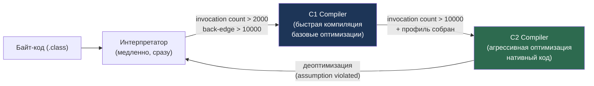
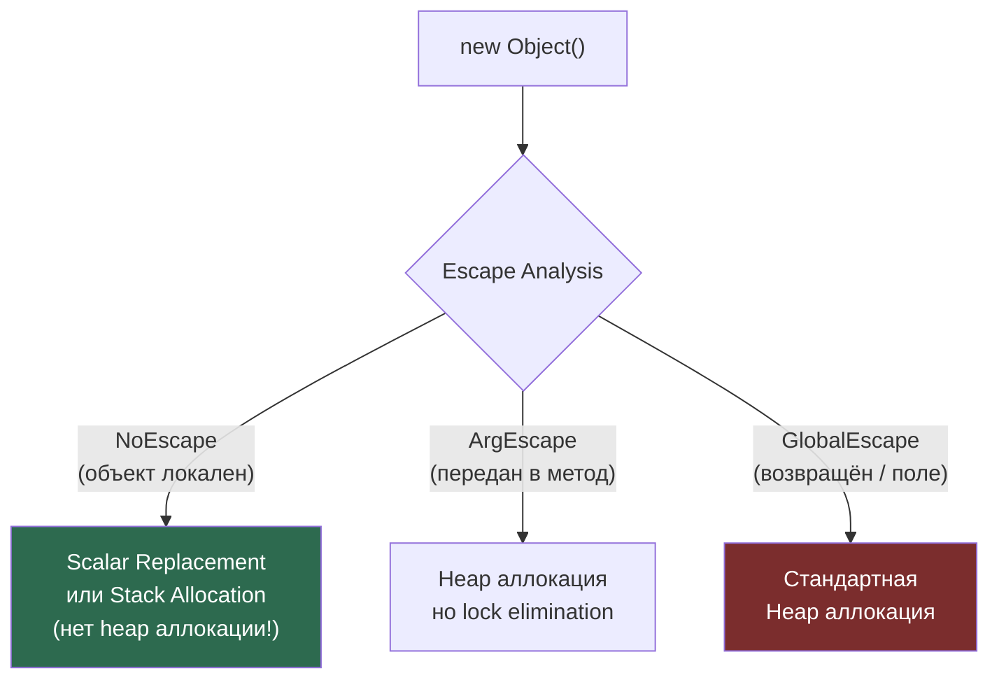
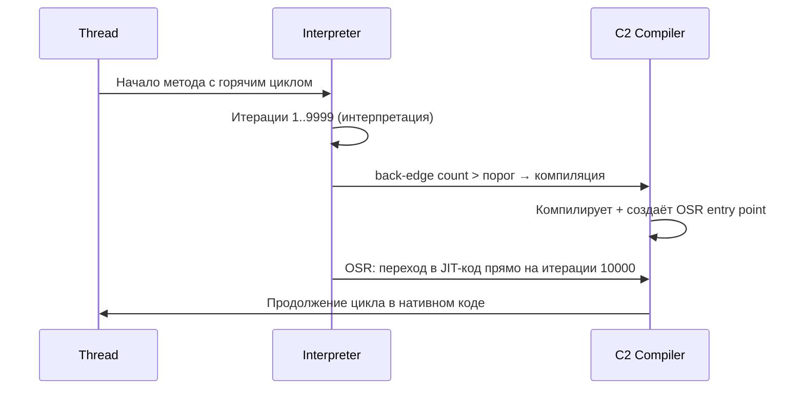

# JIT Compiler & Optimizations

> [!QUOTE] Суть
> **JIT** (Just-In-Time) компилирует "горячий" байт-код в нативный. Два компилятора: **C1** (быстро, базовые оптимизации) → **C2** (медленно, агрессивные оптимизации: инлайнинг, escape analysis, SIMD). Деоптимизация: если предположение C2 нарушается — откат к интерпретатору.

## 1. Архитектура: Interpretation → C1 → C2



### Tiered Compilation (по умолчанию с Java 8)

| Уровень | Компилятор | Описание |
|---|---|---|
| 0 | Интерпретатор | Без профилирования |
| 1 | C1 | Простые оптимизации, нет профилирования |
| 2 | C1 | Ограниченное профилирование |
| 3 | C1 | Полное профилирование (счётчики вызовов, branch profiling) |
| 4 | C2 | Агрессивная оптимизация на основе профиля C1 |

**Ключевые пороги (HotSpot defaults):**
- `CompileThreshold=10000` — количество вызовов метода до C2
- `OnStackReplacePercentage=140` — порог для OSR (On-Stack Replacement)
- Просмотр: `-XX:+PrintCompilation`

---

## 2. Escape Analysis

Escape Analysis определяет, "вытекает" ли объект за пределы метода или потока.



### Bad Practice vs Senior Way

```java
// BAD: Создание объекта ради побочного эффекта — утечка escape
public static long sumBad(int n) {
    long sum = 0;
    for (int i = 0; i < n; i++) {
        Point p = new Point(i, i * 2);  // JIT может не оптимизировать
        sum += p.x + p.y;               // если Point передаётся в другой метод
    }
    return sum;
}

// SENIOR WAY: JIT видит NoEscape → Scalar Replacement (нет аллокации!)
public static long sumGood(int n) {
    long sum = 0;
    for (int i = 0; i < n; i++) {
        // p.x → локальная переменная, p.y → локальная переменная
        // JIT заменяет Point на два long — нет объекта в heap вообще
        sum += i + i * 2L;
    }
    return sum;
}
```

**Scalar Replacement** — разбиение объекта на его поля как локальные переменные.
**Lock Elimination** — удаление синхронизации для NoEscape/ArgEscape объектов:

```java
// JIT УДАЛЯЕТ lock — StringBuffer локален, не вытекает
public String buildLocal() {
    StringBuffer sb = new StringBuffer(); // Escape: NoEscape → lock eliminated!
    sb.append("Hello ").append("World");
    return sb.toString();
}
```

---

## 3. Method Inlining

Инлайнинг — самая важная JIT-оптимизация. Устраняет overhead вызова метода и открывает дверь для дальнейших оптимизаций.

```java
// До инлайнинга:
int result = add(a, b);

// После инлайнинга (JIT заменяет вызов телом метода):
int result = a + b;
```

### Ограничения и контроль

```
-XX:MaxInlineSize=35           // байт байт-кода (маленькие методы, default)
-XX:FreqInlineSize=325         // байт для "горячих" методов
-XX:MaxRecursiveInlineLevel=1  // глубина рекурсивного инлайнинга
-XX:+PrintInlining             // вывод решений об инлайнинге
```

### Мегаморфные call sites — враг инлайнинга

```java
// BAD: JIT не может инлайнить — 3+ реализации Shape
// Биморфный (2 типа) — JIT инлайнит оба с guard
// Мегаморфный (3+ типов) — JIT отказывается от инлайнинга → vtable dispatch
for (Shape shape : shapes) { // shapes содержит Circle, Square, Triangle...
    shape.area();             // мегаморфный call site
}

// SENIOR WAY: Монофонический call site → инлайнинг гарантирован
List<Circle> circles = ...; // только Circle
for (Circle c : circles) {
    c.area(); // JIT: "это всегда Circle" → inline!
}
```

**Совет:** JIT профилирует типы в call sites. Если в продакшне появится новый подтип — произойдёт деоптимизация.

---

## 4. Loop Optimizations

### Loop Unrolling

```java
// Исходный код:
for (int i = 0; i < 8; i++) {
    arr[i] = i * 2;
}

// После Loop Unrolling (JIT разворачивает цикл):
arr[0] = 0; arr[1] = 2; arr[2] = 4; arr[3] = 6;
arr[4] = 8; arr[5] = 10; arr[6] = 12; arr[7] = 14;
// Нет branch/counter overhead, CPU pipeline эффективнее
```

### Loop Vectorization (SIMD)

```java
// JIT может использовать SIMD инструкции (SSE/AVX):
float[] a = new float[1024];
float[] b = new float[1024];
float[] c = new float[1024];

// JIT автоматически векторизует:
for (int i = 0; i < a.length; i++) {
    c[i] = a[i] + b[i]; // → vmovups + vaddps (обрабатывает 8 float за раз)
}
```

### Auto-Vectorization условия:
- Массивы примитивов
- Простые тела цикла (нет сложной логики/исключений)
- Нет алиасинга (JIT должен доказать независимость)
- Флаг: `-XX:+UseSuperWord` (включён по умолчанию)

---

## 5. On-Stack Replacement (OSR)

OSR позволяет заменить интерпретируемый цикл JIT-кодом **без перезапуска метода**.



---

## 6. Deoptimization (Деоптимизация)

JIT делает **спекулятивные оптимизации** на основе профиля. При нарушении предположений — откат.

```java
// JIT предположил: "этот метод всегда вызывается с Integer"
// Оптимизировал вызов под Integer.hashCode()
// Но пришёл Long → uncommonly_trap → deopt → интерпретатор
```

**Диагностика:**
```bash
-XX:+TraceDeoptimization          # трассировка деоптимизаций
-XX:+PrintCompilation              # с флагом "made not entrant"
jcmd <pid> Compiler.directives_print
```

**Причины деоптимизации:**
- `null_check` — NullPointerException
- `class_check` — нарушение предположения о типе
- `unreached` — блок кода неожиданно выполнился
- `unstable_if` — branch prediction оказался неверным

---

## 7. Intrinsics

JIT заменяет некоторые методы оптимизированными нативными имплементациями.

```java
// Следующие методы — JIT Intrinsics (нативные, суперфаст):
Math.abs(), Math.min(), Math.max()
System.arraycopy()           // → memcpy/memmove
String.equals()              // → векторное сравнение
Arrays.fill()                // → memset
Integer.bitCount()           // → popcnt инструкция CPU
Integer.numberOfLeadingZeros()  // → lzcnt / bsr
```

**Просмотр intrinsics:** `-XX:+PrintIntrinsics`

---

## 8. Практические флаги для профилирования JIT

```bash
# Что компилируется:
-XX:+PrintCompilation

# Причины деоптимизации:
-XX:+TraceDeoptimization

# Размер code cache:
-XX:ReservedCodeCacheSize=256m

# Отключить C2 (только C1, диагностика):
-XX:TieredStopAtLevel=1

# Отключить JIT полностью (интерпретатор):
-Xint

# Логи JIT компилятора (детально):
-XX:+UnlockDiagnosticVMOptions -XX:+LogCompilation -XX:LogFile=jit.log
```

---

## Senior Insights

### Cache Locality и JIT

JIT учитывает cache locality при оптимизации. `ArrayList` vs `LinkedList` — это не просто Big-O, это cache miss:

```java
// BAD: LinkedList → каждый элемент — отдельный heap объект → cache miss
LinkedList<Integer> list = new LinkedList<>();
for (int x : list) { process(x); } // L2/L3 miss на каждом узле

// SENIOR WAY: ArrayList → элементы рядом в памяти → cache friendly
ArrayList<Integer> list = new ArrayList<>();
for (int x : list) { process(x); } // prefetcher работает, почти L1 cache
```

### @Contended для устранения False Sharing

```java
import jdk.internal.vm.annotation.Contended;
// Или sun.misc.Contended (pre-Java 9)

// BAD: Поля в одной cache line → false sharing → производительность падает в 10x
class BadCounter {
    volatile long counter1 = 0;  // cache line 64 байт
    volatile long counter2 = 0;  // В ТОЙ ЖЕ cache line!
    // Thread-1 пишет counter1 → инвалидирует cache line → Thread-2 промах!
}

// SENIOR WAY: @Contended добавляет padding → разные cache lines
class GoodCounter {
    @Contended volatile long counter1 = 0;  // своя cache line
    @Contended volatile long counter2 = 0;  // своя cache line
    // Требует: -XX:-RestrictContended
}
```

**Реальный пример false sharing в JVM:** `LongAdder` внутри использует `@Contended` для своих ячеек — именно поэтому он быстрее `AtomicLong` при высокой конкуренции.

---

## Senior Interview Q&A

**Q1: Что такое Tiered Compilation и почему она используется по умолчанию?**

> Tiered Compilation (Java 7+, default Java 8+) комбинирует C1 и C2: C1 быстро компилирует "тёплый" код с минимальной задержкой, одновременно собирая профиль (типы, частоты ветвлений). Когда C2 видит накопленный профиль C1, он применяет спекулятивные оптимизации (инлайнинг по типу, deopt guards). Результат: быстрый старт приложения (C1) + пиковая производительность (C2). Без Tiered: либо медленный старт (долго ждём C2), либо низкая пиковая производительность (только C1).

**Q2: Почему мегаморфный call site так опасен для производительности?**

> При биморфном call site (2 типа) JIT генерирует inline cache с двумя guard-ами и инлайнит оба метода. При 3+ типах (мегаморфный) JIT отказывается от инлайнинга и генерирует vtable dispatch — каждый вызов идёт через таблицу виртуальных методов. Это: (1) нет инлайнинга → нет constant folding, DCE и других оптимизаций; (2) непредсказуемый branch → CPU branch predictor промахивается; (3) indirect call → instruction cache miss. На горячем пути разница может быть 5-10x.

**Q3: Что такое On-Stack Replacement и когда оно применяется?**

> OSR (On-Stack Replacement) позволяет JIT заменить интерпретируемый фрейм метода JIT-скомпилированным прямо во время его выполнения — без ожидания следующего вызова. Применяется для методов с горячими циклами, которые редко вызываются, но долго выполняются (например, метод `main()` с большим циклом). JIT компилирует метод и создаёт специальную OSR точку входа; при достижении back-edge count порога (≈`CompileThreshold * OnStackReplacePercentage / 100`) JVM делает "прыжок" из интерпретатора в JIT-код прямо посередине итерации.

**Q4: Как Escape Analysis влияет на синхронизацию?**

> Если объект не вытекает за пределы потока (NoEscape или ArgEscape), JIT применяет Lock Elimination: полностью удаляет все `monitorenter`/`monitorexit` инструкции для этого объекта. Это объясняет, почему `new StringBuffer().append(a).append(b).toString()` в локальном контексте не медленнее `StringBuilder` — JIT удаляет все lock-и. Аналогично, `Collections.synchronizedList(new ArrayList<>())` в локальной переменной не даёт overhead синхронизации.

**Q5: Что такое деоптимизация и как её минимизировать?**

> Деоптимизация (uncommon trap) — откат от JIT-кода к интерпретатору при нарушении спекулятивного предположения. Например: JIT предположил "поле всегда non-null" → увидел null → deopt. Деоптимизация дорогая: аннулирует скомпилированный метод, возвращает в интерпретатор, повторно профилирует. Минимизация: (1) избегать полиморфных call sites на горячем пути; (2) не добавлять новые подтипы после "прогрева" — JIT теряет монофоничность; (3) final/private методы JIT инлайнит без guard → нет deopt risk; (4) следить за `-XX:+TraceDeoptimization` в production.

## Связанные темы

- [[Java Memory Structure]] — Heap, Code Cache, GC влияние на JIT
- [[JVM Profiling & Observability]] — JFR, async-profiler для анализа JIT
- [[Модель памяти Java (JMM) и барьеры памяти]] — memory barriers в JIT-коде
- [[CAS и Unsafe]] — низкоуровневые операции, используемые JIT intrinsics
