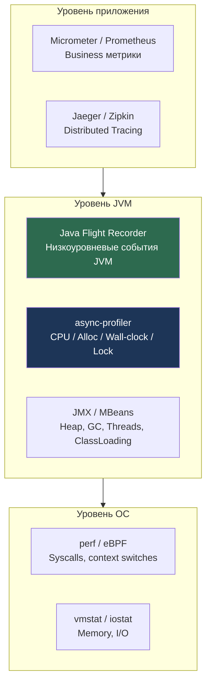
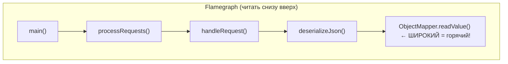

# JVM Profiling & Observability

> [!QUOTE] Суть
> Инструменты профилирования: **JFR** (Java Flight Recorder, low-overhead, production-safe), **async-profiler** (CPU/alloc/lock, wall-clock), **jstack** (thread dump), **jmap** (heap dump), **VisualVM/JConsole** (GUI). Diagnose: CPU-bound → CPU sampling, Memory leak → heap dump + MAT.

## 1. Слои наблюдаемости JVM



---

## 2. Java Flight Recorder (JFR)

JFR — встроенный в JVM профилировщик с **< 1% overhead**. Production-safe.

### 2.1. Запуск JFR

```bash
# Способ 1: При старте JVM (запись в файл)
java -XX:+FlightRecorder \
     -XX:StartFlightRecording=duration=60s,filename=app.jfr \
     -jar myapp.jar

# Способ 2: jcmd к работающей JVM
jcmd <pid> JFR.start duration=120s filename=/tmp/app.jfr name=MyRec

# Остановить и сохранить:
jcmd <pid> JFR.stop name=MyRec

# Дамп без остановки (для streaming):
jcmd <pid> JFR.dump name=MyRec filename=/tmp/snapshot.jfr

# Просмотр активных записей:
jcmd <pid> JFR.check
```

### 2.2. Анализ через JFR Streaming API (Java 14+)

```java
import jdk.jfr.consumer.*;

// Стриминг событий JFR в реальном времени:
try (var stream = RecordingStream.ofConfiguration(
        Configuration.getConfiguration("profile"))) {

    // CPU события:
    stream.onEvent("jdk.CPUSample", event -> {
        System.out.println("CPU: " + event.getDouble("systemCpuLoad"));
    });

    // GC паузы:
    stream.onEvent("jdk.GCPhasePause", event -> {
        Duration duration = event.getDuration("duration");
        if (duration.toMillis() > 100) {
            System.out.println("Long GC pause: " + duration);
        }
    });

    // Аллокации (только sampling, не каждая):
    stream.onEvent("jdk.ObjectAllocationInNewTLAB", event -> {
        long size = event.getLong("tlabSize");
        String className = event.getClass("objectClass").getName();
        System.out.printf("Alloc: %s, size: %d%n", className, size);
    });

    // Метод, вызвавший аллокацию:
    stream.setReuse(true); // переиспользовать объект события
    stream.start();
}
```

### 2.3. Ключевые JFR события

| Категория | Событие | Что показывает |
|---|---|---|
| CPU | `jdk.CPUSample` | Загрузка CPU (system/user) |
| GC | `jdk.GCPhasePause` | Длительность GC пауз |
| GC | `jdk.GarbageCollection` | Тип GC, до/после heap |
| Memory | `jdk.ObjectAllocationInNewTLAB` | Аллокации (sampling) |
| IO | `jdk.FileRead/Write` | Файловые I/O операции |
| IO | `jdk.SocketRead/Write` | Сетевые операции |
| Thread | `jdk.ThreadSleep` | Sleeping потоки |
| Thread | `jdk.MonitorWait` | Ожидание на мониторе |
| JIT | `jdk.Compilation` | JIT компиляции |
| ClassLoad | `jdk.ClassLoad` | Загрузка классов |

### 2.4. Кастомные JFR события

```java
import jdk.jfr.*;

@Label("User Login")
@Description("Fired when user successfully authenticates")
@Category({"Business", "Security"})
@StackTrace(false) // не записывать stack trace (дешевле)
public class UserLoginEvent extends Event {
    @Label("User ID")
    public long userId;

    @Label("Auth Method")
    public String authMethod;

    @Label("Duration")
    @Timespan(Timespan.MILLISECONDS)
    public long durationMs;
}

// Использование:
UserLoginEvent event = new UserLoginEvent();
event.begin(); // старт таймера
try {
    // ... логика аутентификации
    event.userId = user.getId();
    event.authMethod = "JWT";
} finally {
    event.end();
    event.commit(); // записать в JFR буфер
}
```

---

## 3. async-profiler

async-profiler — **не-SafePoint** профилировщик с минимальным overhead. Единственный правильный CPU профилировщик для JVM.

### 3.1. Почему async-profiler, а не JVMTI CPU Sampling?

```
Традиционный JVMTI sampling:
  → Останавливает поток только в SafePoint
  → SafePoint Bias: показывает горячие места ~SafePoint кода
  → НЕ показывает горячие spin-loops (они редко в SafePoint)
  → Даёт ЛОЖНУЮ картину!

async-profiler (AsyncGetCallTrace):
  → Прерывает поток в ЛЮБОЙ момент через OS сигналы (SIGPROF)
  → Честный стек трейс без SafePoint bias
  → Видит нативный код и JIT-скомпилированный код
```

### 3.2. Режимы профилирования

```bash
# 1. CPU профилирование (по умолчанию):
./asprof -d 30 -f flamegraph.html <pid>

# 2. Heap allocation профилирование:
./asprof -e alloc -d 30 -f alloc.html <pid>

# 3. Wall-clock (включает блокирующие потоки):
./asprof -e wall -d 30 -f wall.html <pid>
# Полезно: видит IO-ожидание, network latency

# 4. Lock профилирование:
./asprof -e lock -d 30 -f lock.html <pid>

# 5. Через Java API:
./asprof -d 60 -f output.jfr <pid>  # сохранить как JFR файл
```

### 3.3. Flamegraph анализ

```
Flamegraph читается снизу вверх:
  - Нижние фреймы = точки входа (main, thread start)
  - Верхние фреймы = где CPU проводит время
  - Ширина плато = % CPU времени
  - "Плоские" широкие верхушки = ГОРЯЧИЕ МЕТОДЫ → оптимизируй их!

Цвета:
  - Зелёный: Java-код
  - Оранжевый: C/C++ нативный код
  - Жёлтый: ядро ОС (kernel)
  - Красный: JIT-скомпилированный код
```



### 3.4. Async-profiler через Java API

```java
// Интеграция в приложение:
import one.profiler.AsyncProfiler;

AsyncProfiler profiler = AsyncProfiler.getInstance();

// Старт CPU профилирования:
profiler.execute("start,event=cpu,interval=10ms,file=/tmp/profile.jfr");

// ... работа приложения ...

// Стоп и сохранение:
profiler.execute("stop");

// Или через команды:
profiler.start(Events.CPU, 10_000_000); // 10ms interval в наносекундах
Thread.sleep(30_000);
profiler.stop();
profiler.dumpFlame("/tmp/flame.html");
```

---

## 4. Heap Dump анализ

### 4.1. Получение heap dump

```bash
# 1. Автоматически при OOM:
java -XX:+HeapDumpOnOutOfMemoryError \
     -XX:HeapDumpPath=/tmp/heapdump.hprof \
     -jar myapp.jar

# 2. Вручную через jcmd (live=true - только достижимые):
jcmd <pid> GC.heap_dump filename=/tmp/live.hprof

# 3. Через jmap (устаревший, но работает):
jmap -dump:live,format=b,file=/tmp/heap.hprof <pid>

# 4. Через JMX (programmatic):
com.sun.management.HotSpotDiagnosticMXBean bean =
    ManagementFactory.getPlatformMXBean(HotSpotDiagnosticMXBean.class);
bean.dumpHeap("/tmp/programmatic.hprof", true);
```

### 4.2. Анализ в Eclipse MAT (Memory Analyzer Tool)

```
Ключевые отчёты MAT:

1. Leak Suspects Report:
   → Автоматически ищет подозрительные накопления объектов
   → "Problem suspect 1: 892 MB retained by org.example.UserCache"

2. Dominator Tree:
   → Объекты, удержание которых занимает больше всего памяти
   → Shallow Size: размер объекта
   → Retained Size: сколько освободится если удалить объект

3. OQL (Object Query Language):
   SELECT * FROM java.util.ArrayList a WHERE a.size > 10000
   → Найти все ArrayList больше 10000 элементов

4. Thread Overview:
   → Стеки всех потоков в момент dump
   → Объекты на каждом стеке

5. Histogram:
   → Топ классов по количеству экземпляров и retained heap
```

### 4.3. Programmatic Heap Analysis (OQL)

```java
// Анализ через JVMTI API (в агенте):
// Или использование MAT headless:
// ./mat/MemoryAnalyzer -consoleLog -nosplash -application \
//     org.eclipse.mat.api.parse "/tmp/heap.hprof" \
//     "org.eclipse.mat.api:suspects"
```

---

## 5. JVM Metrics (JMX / MBeans)

```java
import java.lang.management.*;

// Heap использование:
MemoryMXBean memory = ManagementFactory.getMemoryMXBean();
MemoryUsage heap = memory.getHeapMemoryUsage();
System.out.printf("Heap: used=%dMB, max=%dMB%n",
    heap.getUsed() / 1_000_000, heap.getMax() / 1_000_000);

// GC статистика:
for (GarbageCollectorMXBean gc : ManagementFactory.getGarbageCollectorMXBeans()) {
    System.out.printf("GC %s: count=%d, time=%dms%n",
        gc.getName(), gc.getCollectionCount(), gc.getCollectionTime());
}

// Потоки:
ThreadMXBean threads = ManagementFactory.getThreadMXBean();
System.out.printf("Live threads: %d, Peak: %d%n",
    threads.getThreadCount(), threads.getPeakThreadCount());

// Deadlock detection:
long[] deadlocked = threads.findDeadlockedThreads();
if (deadlocked != null) {
    ThreadInfo[] info = threads.getThreadInfo(deadlocked, true, true);
    // обработка deadlock
}

// CPU время конкретного потока:
threads.setThreadCpuTimeEnabled(true);
long cpuTime = threads.getThreadCpuTime(Thread.currentThread().getId());
```

---

## 6. Диагностика через jcmd (Swiss Army Knife)

```bash
# Список всех JVM процессов:
jcmd -l

# Все команды для процесса:
jcmd <pid> help

# Heap информация:
jcmd <pid> GC.heap_info

# Запуск GC:
jcmd <pid> GC.run

# Native Memory Tracking (нужен -XX:NativeMemoryTracking=summary):
jcmd <pid> VM.native_memory summary

# Флаги JVM:
jcmd <pid> VM.flags

# System properties:
jcmd <pid> VM.system_properties

# Стек всех потоков (аналог jstack):
jcmd <pid> Thread.print

# Загруженные классы:
jcmd <pid> VM.class_hierarchy

# Compiler directives:
jcmd <pid> Compiler.directives_print

# JFR:
jcmd <pid> JFR.start duration=60s filename=/tmp/rec.jfr
jcmd <pid> JFR.stop

# Статистика объектов (без Full GC):
jcmd <pid> GC.class_histogram | head -30
```

---

## 7. Micrometer + Prometheus интеграция

```java
// Spring Boot Actuator автоматически экспортирует JVM метрики:
// Dependency: micrometer-registry-prometheus

// Автоматически доступны:
// jvm_memory_used_bytes{area="heap",id="G1 Eden Space"}
// jvm_gc_pause_seconds_sum{action="end of major GC",cause="G1 Humongous Allocation"}
// jvm_threads_live_threads
// jvm_classes_loaded_classes
// process_cpu_usage

// Кастомные метрики:
@Bean
MeterRegistryCustomizer<MeterRegistry> metricsCommonTags() {
    return registry -> registry.config()
        .commonTags("application", "user-service",
                    "env", "production");
}

// Таймер для метода:
@Autowired MeterRegistry registry;

Timer timer = Timer.builder("service.method.duration")
    .tag("method", "processUser")
    .description("Time taken to process user")
    .register(registry);

timer.record(() -> processUser(user));

// Gauge для размера кэша:
Gauge.builder("cache.size", cache, Cache::size)
    .tag("name", "userCache")
    .register(registry);
```

---

## Senior Insights

### JFR vs async-profiler: когда что использовать

```
JFR:
✅ Production (< 1% overhead при default настройках)
✅ Долгосрочный мониторинг (часы/дни)
✅ Встроен в JVM, нет зависимостей
✅ Кастомные бизнес события
✅ JFR Streaming API (real-time)
❌ SafePoint bias (хотя меньше чем JVMTI)
❌ CPU sampling resolution ограничен (10ms default)

async-profiler:
✅ Нет SafePoint bias → честная картина CPU
✅ Allocation profiling с call tree
✅ Wall-clock mode (видит waiting/IO потоки)
✅ Flamegraph output (HTML)
✅ Lock profiling
❌ Требует root или CAP_SYS_ADMIN в контейнере
❌ Attach к JVM (небольшой риск для production)
❌ Нет долгосрочного streaming
```

### Диагностика Memory Leak паттерн

```
1. Симптом: Heap растёт после каждого Full GC
2. Получаем heap dump: jcmd <pid> GC.heap_dump ...
3. MAT: Dominator Tree → что занимает больше всего retained?
4. MAT: Path to GC Roots → почему этот объект жив?
5. Типичные виновники:
   - ThreadLocal без remove() в thread pool
   - static Map/List которые только растут
   - Event listeners не отписанные
   - ClassLoader leaks (в OSGi, Tomcat hot reload)
   - Внутренние кэши в сторонних библиотеках
```

---

## Senior Interview Q&A

**Q1: Почему SafePoint Bias делает JVMTI CPU profiling ненадёжным?**

> JVMTI sampling останавливает поток для получения стека только в SafePoint-ах — специальных точках в байт-коде где JVM знает полное состояние всех объектов. Проблема: goto/loop back-edge-ы это SafePoint, но spin-loops на примитивах или tight loops без object access — НЕТ. Если горячий метод выполняет `while(counter < limit) { counter++; }` — JVMTI никогда не "поймает" его: он не проходит SafePoint. async-profiler использует SIGPROF + AsyncGetCallTrace — OS прерывает поток в ЛЮБОЙ момент независимо от SafePoint. Результат: async-profiler показывает реальные горячие места, JVMTI — места около SafePoint.

**Q2: Как JFR Streaming API позволяет real-time мониторинг без записи в файл?**

> JFR хранит события в ring buffer в памяти JVM. `RecordingStream` читает из этого буфера в реальном времени: `stream.onEvent("jdk.GCPhasePause", handler)` регистрирует callback который вызывается для каждого события. Поток `RecordingStream` работает в фоне, периодически читая из buffer (configurable через `setMaxAge`/`setMaxSize`). Это позволяет: мониторить GC паузы и алертить если пауза > 200ms, анализировать аллокации в real-time, триггерить heap dump при определённых условиях — всё без записи в файл и без значительного overhead.

**Q3: Что показывает Retained Size в MAT и почему он важнее Shallow Size?**

> Shallow Size — только размер самого объекта (заголовок + поля). Retained Size — сколько памяти освободится если этот объект и все объекты, доступные ТОЛЬКО через него, будут удалены GC. Пример: `ArrayList` из 1M строк — Shallow Size = 40 байт (только внутренний массив ссылок), Retained Size = 40 + 1M*(56+длина строки) байт. В Dominator Tree MAT показывает Retained Size — это реальный impact объекта на память. Если вижу объект с Retained Size = 800MB — вот ваш memory leak!

**Q4: Как диагностировать CPU throttling в Kubernetes контейнере через JVM метрики?**

> CPU throttling в k8s происходит когда контейнер превышает `cpu.limits`. JVM видит это как увеличение latency без видимой причины в профиле. Диагностика: (1) `container_cpu_cfs_throttled_seconds_total` в Prometheus — если > 20% → throttling; (2) `jvm_gc_pause_seconds` возрастают — GC потоки также throttled; (3) async-profiler wall-clock mode покажет потоки "ждущие" CPU не из-за IO, а из-за планировщика. Решение: увеличить `cpu.limits` или использовать `-XX:ActiveProcessorCount` (JDK 10+) для корректного обнаружения vCPU.

**Q5: Как использовать JFR кастомные события для business observability?**

> Кастомные JFR события позволяют добавить бизнес-контекст в низкоуровневый профиль JVM: `@Name("com.company.UserLogin") class UserLoginEvent extends Event { public long userId; public String region; }`. Преимущества: (1) когда видишь в JFR запись "долгий GC" — рядом видишь какой именно user request обрабатывался → корреляция; (2) overhead минимален — JFR использует lock-free буферы; (3) `event.shouldCommit()` проверяет включён ли threshold перед вычислением expensive полей; (4) можно анализировать вместе с системными событиями в JMC — видеть "user login занял 500ms из которых 300ms GC пауза".

## Связанные темы

- [[JIT Compiler & Optimizations]] — что JIT делает с горячим кодом
- [[Java Agents & Instrumentation API]] — агенты для профилировщиков
- [[Java Memory Structure]] — GC алгоритмы и диагностика памяти
- [[Grafana, Prometheus, OpenTelemetry и Jaeger]] — метрики и трейсинг
