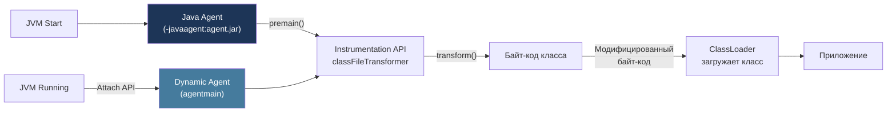

# Java Agents & Instrumentation API

> [!QUOTE] Суть
> **Java Agent** (`-javaagent:agent.jar`) — подключается к JVM до или во время работы, трансформирует байт-код через `ClassFileTransformer`. Основа APM (Datadog, Dynatrace), AOP (AspectJ LTW), JaCoCo. `premain()` — вход агента при старте, `agentmain()` — для attach к уже работающей JVM.

## 1. Архитектура Java Agent



## 2. Два режима загрузки агента

### 2.1. Static Agent (premain) — до старта приложения

```java
// MANIFEST.MF:
// Premain-Class: com.example.MyAgent
// Can-Retransform-Classes: true
// Can-Redefine-Classes: true

public class MyAgent {
    public static void premain(String args, Instrumentation inst) {
        System.out.println("Agent loaded, args: " + args);

        // Регистрируем трансформатор байт-кода
        inst.addTransformer(new MyTransformer(), true); // true = canRetransform

        // Можно ретрансформировать уже загруженные классы:
        // inst.retransformClasses(SomeClass.class);
    }
}
```

**Запуск:**
```bash
java -javaagent:myagent.jar=param1=value1 -jar myapp.jar
```

### 2.2. Dynamic Agent (agentmain) — к работающей JVM (Attach API)

```java
// В агенте:
public class MyAgent {
    public static void agentmain(String args, Instrumentation inst) {
        // Загружается в уже работающую JVM
        inst.addTransformer(new MyTransformer(), true);
        inst.retransformClasses(TargetClass.class);
    }
}

// Аттачинг к работающей JVM (отдельный процесс):
import com.sun.tools.attach.*;

VirtualMachine vm = VirtualMachine.attach(pid); // pid как String
vm.loadAgent("/path/to/agent.jar", "args");
vm.detach();
```

---

## 3. Instrumentation API — ключевые методы

```java
public interface Instrumentation {
    // Регистрация трансформатора (вызывается при каждой загрузке класса)
    void addTransformer(ClassFileTransformer transformer, boolean canRetransform);

    // Ретрансформация уже загруженных классов (нужен canRetransform=true)
    void retransformClasses(Class<?>... classes) throws UnmodifiableClassException;

    // Переопределение класса полностью (нужен canRedefine=true)
    void redefineClasses(ClassDefinition... definitions) throws ...;

    // Размер объекта (без полей дочерних объектов)
    long getObjectSize(Object objectToSize);

    // Все загруженные классы:
    Class<?>[] getAllLoadedClasses();

    // Список классов, загруженных данным ClassLoader:
    Class<?>[] getInitiatedClasses(ClassLoader loader);
}
```

### ClassFileTransformer

```java
public class TimingTransformer implements ClassFileTransformer {
    @Override
    public byte[] transform(
        ClassLoader loader,
        String className,         // "com/example/MyService" (с '/')
        Class<?> classBeingRedefined,
        ProtectionDomain domain,
        byte[] classfileBuffer    // оригинальный байт-код
    ) throws IllegalClassFormatException {

        if (!className.startsWith("com/example/")) {
            return null; // null = без изменений
        }

        // Трансформируем байт-код (ASM, ByteBuddy и т.д.)
        return transformedBytes;
    }
}
```

---

## 4. Low-Level: ASM

ASM — низкоуровневая библиотека для работы с байт-кодом. Visitor pattern.

```java
import org.objectweb.asm.*;

// Трансформатор: добавляет System.out.println перед каждым методом
public class MethodTimingTransformer extends ClassFileTransformer {
    @Override
    public byte[] transform(ClassLoader loader, String className,
                            Class<?> redefined, ProtectionDomain pd,
                            byte[] bytes) {
        if (!className.equals("com/example/UserService")) return null;

        ClassReader reader = new ClassReader(bytes);
        ClassWriter writer = new ClassWriter(ClassWriter.COMPUTE_FRAMES);

        ClassVisitor visitor = new ClassVisitor(Opcodes.ASM9, writer) {
            @Override
            public MethodVisitor visitMethod(int access, String name,
                                             String desc, String signature,
                                             String[] exceptions) {
                MethodVisitor mv = super.visitMethod(access, name, desc, signature, exceptions);
                return new MethodEnterVisitor(mv, name);
            }
        };

        reader.accept(visitor, ClassReader.EXPAND_FRAMES);
        return writer.toByteArray();
    }
}

class MethodEnterVisitor extends MethodVisitor {
    private final String methodName;

    MethodEnterVisitor(MethodVisitor mv, String name) {
        super(Opcodes.ASM9, mv);
        this.methodName = name;
    }

    @Override
    public void visitCode() {
        super.visitCode();
        // Инжектируем: System.out.println("Entering: " + methodName)
        mv.visitFieldInsn(Opcodes.GETSTATIC, "java/lang/System", "out",
                         "Ljava/io/PrintStream;");
        mv.visitLdcInsn("Entering: " + methodName);
        mv.visitMethodInsn(Opcodes.INVOKEVIRTUAL, "java/io/PrintStream",
                          "println", "(Ljava/lang/String;)V", false);
    }
}
```

---

## 5. High-Level: ByteBuddy

ByteBuddy — высокоуровневое API для манипуляций байт-кодом. Используется в Mockito, Hibernate, Spring.

### 5.1. Создание класса динамически

```java
import net.bytebuddy.ByteBuddy;
import net.bytebuddy.implementation.FixedValue;
import static net.bytebuddy.matcher.ElementMatchers.*;

// Создать класс, переопределяющий toString()
Class<?> dynamicType = new ByteBuddy()
    .subclass(Object.class)
    .method(named("toString"))
    .intercept(FixedValue.value("Hello from ByteBuddy!"))
    .make()
    .load(getClass().getClassLoader())
    .getLoaded();

Object instance = dynamicType.getDeclaredConstructor().newInstance();
System.out.println(instance.toString()); // "Hello from ByteBuddy!"
```

### 5.2. Intercept с логикой (MethodDelegation)

```java
public class TimingInterceptor {
    @RuntimeType
    public static Object intercept(@Origin Method method,
                                   @SuperCall Callable<?> superCall) throws Exception {
        long start = System.nanoTime();
        try {
            return superCall.call();
        } finally {
            long elapsed = System.nanoTime() - start;
            System.out.printf("Method %s took %d µs%n",
                              method.getName(), elapsed / 1000);
        }
    }
}

// Применяем к сервису:
UserService proxied = new ByteBuddy()
    .subclass(UserService.class)
    .method(isPublic())
    .intercept(MethodDelegation.to(TimingInterceptor.class))
    .make()
    .load(UserService.class.getClassLoader())
    .getLoaded()
    .getDeclaredConstructor()
    .newInstance();
```

### 5.3. ByteBuddy Agent (premain + Advice)

```java
// Advice — инструментирование без создания подклассов (работает на существующих классах)
public class ServiceAdvice {
    @Advice.OnMethodEnter
    static long enter(@Advice.Origin String method) {
        return System.nanoTime();
    }

    @Advice.OnMethodExit(onThrowable = Throwable.class)
    static void exit(@Advice.Origin String method,
                     @Advice.Enter long startTime,
                     @Advice.Thrown Throwable thrown) {
        long elapsed = System.nanoTime() - startTime;
        if (thrown != null) {
            System.out.printf("ERROR in %s after %d µs: %s%n",
                              method, elapsed / 1000, thrown.getMessage());
        } else {
            System.out.printf("%s took %d µs%n", method, elapsed / 1000);
        }
    }
}

// В premain:
public static void premain(String args, Instrumentation inst) {
    new AgentBuilder.Default()
        .type(nameStartsWith("com.example"))
        .transform((builder, type, loader, module, domain) ->
            builder.visit(Advice.to(ServiceAdvice.class)
                               .on(isMethod().and(isPublic())))
        )
        .installOn(inst);
}
```

---

## 6. Реальные применения

### 6.1. APM-агенты (Datadog, New Relic)

```
Agent инструментирует:
- Все HTTP-методы (Spring MVC, Servlet) → trace spans
- JDBC вызовы → DB query tracking
- Kafka consumer/producer → message tracing
- Все это без изменения кода приложения!
```

### 6.2. Измерение размера объектов

```java
public static void premain(String args, Instrumentation inst) {
    InstrumentationHolder.instrumentation = inst;
}

public class ObjectSizer {
    public static long sizeOf(Object obj) {
        return InstrumentationHolder.instrumentation.getObjectSize(obj);
    }
}

// Использование:
System.out.println(ObjectSizer.sizeOf(new ArrayList<>())); // 40 bytes
System.out.println(ObjectSizer.sizeOf("Hello"));           // 56 bytes
```

### 6.3. Hot Reload в разработке (Spring DevTools использует похожий механизм)

```java
// Redefine класс без перезапуска JVM:
byte[] newBytecode = compileClass("MyService.java");
inst.redefineClasses(new ClassDefinition(MyService.class, newBytecode));
// Ограничение: нельзя добавить/удалить поля или методы (только изменить тела)
```

---

## Senior Insights

### Псевдобайткод Bridge Methods (Generics + Covariant returns)

Bridge методы генерируются компилятором для поддержки стирания типов (type erasure) и ковариантных возвращаемых типов:

```java
// Исходный код:
interface Processor<T> {
    T process(T input);
}

class StringProcessor implements Processor<String> {
    @Override
    public String process(String input) { return input.toUpperCase(); }
}

// Компилятор генерирует BRIDGE METHOD (синтетический):
// public Object process(Object input) {   // ← Bridge: implements Processor<Object>.process()
//     return process((String) input);      // ← делегирует в реальный метод
// }

// Байт-код:
// ACC_PUBLIC + ACC_BRIDGE + ACC_SYNTHETIC
// INVOKEVIRTUAL StringProcessor.process:(Ljava/lang/String;)Ljava/lang/String;
```

**Практическое значение для агентов:** При инструментировании нужно фильтровать bridge методы (`(access & ACC_BRIDGE) != 0`), иначе дважды перехватите один логический метод.

### Ограничения redefineClasses vs retransformClasses

```java
// redefineClasses: заменяет класс новым байт-кодом (из файла/сети)
// retransformClasses: пропускает класс через зарегистрированные трансформаторы заново

// НЕЛЬЗЯ через оба механизма:
// - Добавить/удалить поля
// - Добавить/удалить методы
// - Изменить иерархию (extends, implements)
// - Изменить имя класса

// МОЖНО:
// - Изменить тела методов
// - Изменить аннотации
// - Изменить модификаторы методов (visibility)
```

---

## Senior Interview Q&A

**Q1: В чём разница между premain и agentmain?**

> `premain` загружается статически через `-javaagent:agent.jar` до запуска метода `main()` приложения. `agentmain` загружается динамически через Attach API в уже работающую JVM — это используют профилировщики (async-profiler, JProfiler), которые подключаются к production-процессу без перезапуска. Для agentmain MANIFEST.MF должен содержать `Agent-Class:` вместо `Premain-Class:`. Attach API требует, чтобы JVM разрешала аттачинг (`-Djdk.attach.allowAttachSelf=true` для self-attach или права ОС на целевой процесс).

**Q2: Почему ByteBuddy предпочтительнее ASM для большинства агентов?**

> ASM работает на уровне байт-кода: нужно вручную управлять стеком операндов, фреймами и дескрипторами методов — любая ошибка дает `VerifyError` в рантайме. ByteBuddy абстрагирует это: `Advice`, `MethodDelegation` работают с Java-концепциями (аннотации, типы). ByteBuddy также безопаснее при ретрансформации (Advice встраивается в тело метода, не создаёт subclass), что важно для `final` классов и методов. ASM нужен только когда нужен максимальный контроль или нестандартные трансформации.

**Q3: Как агент может измерить реальный размер объектного графа (shallow vs deep size)?**

> `Instrumentation.getObjectSize()` возвращает **shallow size** — только размер самого объекта, без полей-ссылок. Для **deep size** (весь граф) нужно: (1) рефлексией пройти все нестатические поля, (2) рекурсивно суммировать `getObjectSize()` для каждого объекта, (3) трекать visited объекты через `IdentityHashMap` чтобы избежать циклов. Библиотека `java-sizeof` (Jamm) делает это автоматически. Это критично для диагностики memory leaks: `shallowSize(ArrayList(100))` = 40 байт, `deepSize(ArrayList(100 strings))` = 40 + 100*(56+strings.length*2) байт.

**Q4: Что такое safe point и почему агенты должны о нём знать?**

> Safe point — момент, когда все потоки JVM остановлены (Stop-The-World) для операций GC, deoptimization, классового ретрансформации. `retransformClasses()` — операция safe point: все потоки паузятся пока трансформатор обрабатывает байт-код. Для production-агентов это критично: частая ретрансформация вызывает STW паузы. Лучшая практика: трансформировать классы в `premain` (до старта), а не в рантайме через `retransformClasses`.

**Q5: Как ByteBuddy Advice отличается от subclassing?**

> При subclassing ByteBuddy создаёт новый класс-наследник и заменяет инстанцирование. Это не работает для `final` классов и уже созданных объектов. `Advice` встраивает инструкционный код прямо в байт-код оригинального класса (`COMPUTE_FRAMES` перевычисляет stack frames). Advice-код копируется в начало/конец каждого метода как inline — нет дополнительного уровня косвенности, нет allocations для перехватчиков. Это делает Advice идеальным для APM-агентов где overhead должен быть < 1%.

## Связанные темы

- [[Java Reflection API]] — Reflection vs Instrumentation
- [[ClassLoaders]] — загрузка трансформированных классов
- [[JIT Compiler & Optimizations]] — влияние трансформаций на JIT
- [[JVM Profiling & Observability]] — агенты в контексте профилировщиков
