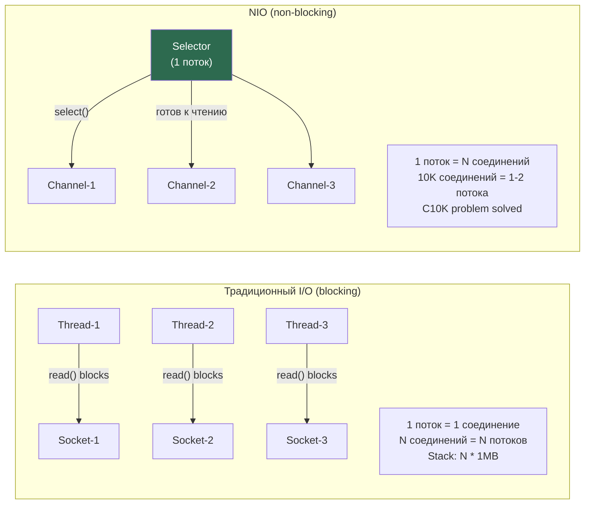
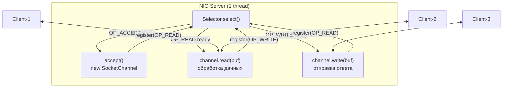
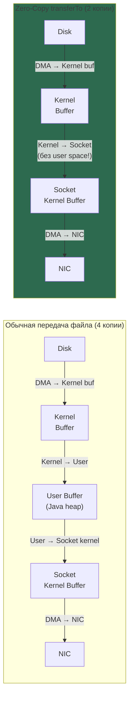

# NIO Networking

> **NIO**: Channel (двунаправленный) + Buffer (данные) + Selector (один поток — N каналов, неблокирующий). **Zero-copy**: `transferTo()` передаёт данные без копирования в user space (sendfile syscall). Основа Netty, Tomcat NIO, высоконагруженных серверов.
> На интервью: ByteBuffer position/limit/capacity, flip() зачем нужен, Selector + SelectionKey ops, zero-copy vs normal copy, direct vs heap buffer.

## Связанные темы

[[Java Input-Output]], [[Virtual Threads — модель и архитектура]], [[ThreadPool, Future, Callable, Executors, CompletableFuture]]

## 1. NIO vs Traditional I/O



---

## 2. ByteBuffer — основа NIO

ByteBuffer — центральный класс NIO. Понимание его режимов критично.

### 2.1. Состояние ByteBuffer

```
capacity = 10  (неизменно после создания)
        ↓
[0][1][2][3][4][5][6][7][8][9]
 ↑                 ↑          ↑
position          limit     capacity

После write (записали 5 байт):
position=5, limit=10, capacity=10

После flip() (переключение в read mode):
position=0, limit=5, capacity=10

После compact() (читали 3 байта):
Прочитанные байты удалены, оставшиеся сдвинуты:
position=2, limit=10, capacity=10
```

### 2.2. Типы ByteBuffer

```java
// Heap ByteBuffer — в Java heap
ByteBuffer heap = ByteBuffer.allocate(1024);

// Direct ByteBuffer — вне Java heap (native memory)
// Используется для I/O: нет лишнего копирования kernel→JVM
ByteBuffer direct = ByteBuffer.allocateDirect(1024);

// Wrapping существующего массива:
byte[] data = new byte[1024];
ByteBuffer wrapped = ByteBuffer.wrap(data);
ByteBuffer slice = ByteBuffer.wrap(data, offset, length);

// Read-only view:
ByteBuffer readOnly = direct.asReadOnlyBuffer();
```

### 2.3. Bad Practice vs Senior Way

```java
// BAD: Неправильная последовательность flip/clear
ByteBuffer buf = ByteBuffer.allocate(1024);
channel.read(buf);       // записали данные в buf
buf.flip();              // position=0, limit=bytesRead ✅
processData(buf);        // читаем данные ✅
// buf.clear() забыли вызвать!
channel.read(buf);       // ОШИБКА: position не в начале — данные испорчены!

// SENIOR WAY: явное управление режимами
ByteBuffer buf = ByteBuffer.allocateDirect(8192); // Direct для I/O

while (channel.read(buf) > 0 || buf.position() > 0) {
    buf.flip();          // write mode → read mode
    while (buf.hasRemaining()) {
        processData(buf.get()); // читаем байт за байтом
    }
    buf.compact();       // сдвигаем непрочитанные данные в начало
    // compact() = НЕ clear() когда не все данные прочитаны (частичные сообщения)
}
```

---

## 3. Channels

```java
import java.nio.*;
import java.nio.channels.*;
import java.net.*;

// Базовая иерархия Channels:
// ReadableByteChannel, WritableByteChannel
//   └── ByteChannel
//       └── SeekableByteChannel (FileChannel)
//       └── NetworkChannel
//           └── SocketChannel
//           └── ServerSocketChannel
//           └── DatagramChannel
```

### 3.1. FileChannel — файловые операции

```java
// Открытие (Java 7+ NIO.2):
try (FileChannel fc = FileChannel.open(
        Path.of("data.bin"),
        StandardOpenOption.READ, StandardOpenOption.WRITE)) {

    // Memory-mapped I/O (самое быстрое чтение больших файлов):
    MappedByteBuffer mapped = fc.map(
        FileChannel.MapMode.READ_WRITE,
        0,        // position
        fc.size() // size
    );
    // mapped — прямой доступ к файлу через виртуальную память!
    byte firstByte = mapped.get(0);
    mapped.put(0, (byte) 42); // пишем прямо в файл (OS flush при unmap)
}

// Locks:
try (FileChannel fc = FileChannel.open(path, WRITE)) {
    FileLock lock = fc.lock(0, Long.MAX_VALUE, false); // exclusive lock
    try {
        // эксклюзивный доступ к файлу между процессами
    } finally {
        lock.release();
    }
}
```

### 3.2. SocketChannel — неблокирующие TCP соединения

```java
// Client:
SocketChannel client = SocketChannel.open();
client.configureBlocking(false); // ключевое!
client.connect(new InetSocketAddress("localhost", 8080));

// Non-blocking connect:
while (!client.finishConnect()) {
    // делаем другую работу пока соединение устанавливается
}

// Чтение/запись:
ByteBuffer buf = ByteBuffer.allocateDirect(4096);
int bytesRead = client.read(buf); // возвращает -1 если закрыт, 0 если нет данных
if (bytesRead > 0) {
    buf.flip();
    // обработка
}

// ServerSocketChannel:
ServerSocketChannel server = ServerSocketChannel.open();
server.bind(new InetSocketAddress(8080));
server.configureBlocking(false);

SocketChannel conn = server.accept(); // null если нет входящих (non-blocking)
```

---

## 4. Selector — мультиплексирование I/O

Selector позволяет одному потоку обслуживать тысячи соединений. Цикл работы:

1. Зарегистрировать `ServerSocketChannel` в `Selector` с интересом `OP_ACCEPT`.
2. Вызвать `selector.select()` — блокируется до появления готовых каналов.
3. Итерировать `selectedKeys()`, удаляя каждый ключ после обработки.
4. При `OP_ACCEPT` — принять соединение и зарегистрировать с `OP_READ`.
5. При `OP_READ` — прочитать данные, подготовить ответ, переключиться на `OP_WRITE`.
6. При `OP_WRITE` — отправить ответ, переключиться обратно на `OP_READ`.



### 4.1. Полный NIO Echo Server

```java
public class NioEchoServer {

    public static void main(String[] args) throws IOException {
        Selector selector = Selector.open();

        ServerSocketChannel server = ServerSocketChannel.open();
        server.bind(new InetSocketAddress(8080));
        server.configureBlocking(false);
        server.register(selector, SelectionKey.OP_ACCEPT);

        System.out.println("NIO Server started on :8080");

        while (true) {
            selector.select(); // блокируется пока нет готовых каналов

            Iterator<SelectionKey> keys = selector.selectedKeys().iterator();
            while (keys.hasNext()) {
                SelectionKey key = keys.next();
                keys.remove(); // ВАЖНО: всегда удалять обработанный ключ!

                if (!key.isValid()) continue;

                if (key.isAcceptable()) {
                    accept(selector, (ServerSocketChannel) key.channel());
                } else if (key.isReadable()) {
                    read(selector, key);
                } else if (key.isWritable()) {
                    write(key);
                }
            }
        }
    }

    private static void accept(Selector selector, ServerSocketChannel server)
            throws IOException {
        SocketChannel client = server.accept();
        client.configureBlocking(false);
        client.register(selector, SelectionKey.OP_READ);
        System.out.println("Accepted: " + client.getRemoteAddress());
    }

    private static void read(Selector selector, SelectionKey key)
            throws IOException {
        SocketChannel client = (SocketChannel) key.channel();
        ByteBuffer buf = ByteBuffer.allocateDirect(1024);

        int bytesRead = client.read(buf);
        if (bytesRead == -1) {
            client.close();
            return;
        }

        buf.flip();
        // Сохраняем buf в attachment для последующей записи:
        key.attach(buf);
        // Переключаем на OP_WRITE когда готовы к ответу:
        key.interestOps(SelectionKey.OP_WRITE);
    }

    private static void write(SelectionKey key) throws IOException {
        SocketChannel client = (SocketChannel) key.channel();
        ByteBuffer buf = (ByteBuffer) key.attachment();

        client.write(buf); // echo back

        if (!buf.hasRemaining()) {
            key.attach(null);
            key.interestOps(SelectionKey.OP_READ); // обратно на чтение
        }
    }
}
```

---

## 5. Zero-Copy: transferTo / transferFrom

Zero-copy — передача данных без копирования через user space. Критично для высоконагруженных файловых серверов.



### 5.1. transferTo в действии

```java
// BAD: Традиционная передача файла — 4 копии
public void sendFileSlow(String path, SocketChannel dest) throws IOException {
    byte[] buffer = new byte[8192];
    try (FileInputStream fis = new FileInputStream(path)) {
        int bytesRead;
        while ((bytesRead = fis.read(buffer)) != -1) {
            dest.write(ByteBuffer.wrap(buffer, 0, bytesRead));
            // Данные: Disk→KernelBuf→JavaHeap→SocketBuf→NIC (4 копии)
        }
    }
}

// SENIOR WAY: Zero-copy — 2 копии, используется в Tomcat, Netty, Nginx Java биндингах
public void sendFileZeroCopy(String filePath, SocketChannel dest) throws IOException {
    try (FileChannel fc = FileChannel.open(Path.of(filePath), StandardOpenOption.READ)) {
        long size = fc.size();
        long position = 0;

        while (position < size) {
            // transferTo: Kernel Buffer → Socket Buffer напрямую
            // Под капотом: sendfile(2) syscall на Linux
            long transferred = fc.transferTo(position, size - position, dest);
            if (transferred > 0) {
                position += transferred;
            }
        }
    }
}

// transferFrom (обратное направление):
public void receiveFile(SocketChannel src, String destPath) throws IOException {
    try (FileChannel fc = FileChannel.open(Path.of(destPath),
            StandardOpenOption.WRITE, StandardOpenOption.CREATE)) {
        long bytesTransferred = fc.transferFrom(src, 0, Long.MAX_VALUE);
    }
}
```

### 5.2. Memory-Mapped Files для максимальной скорости

```java
// Чтение 1GB файла:

// BAD: Чтение по кускам — медленно для random access
RandomAccessFile raf = new RandomAccessFile("bigfile.bin", "r");
byte[] chunk = new byte[4096];
raf.seek(500_000_000); // skip 500MB
raf.read(chunk);       // read 4KB — медленно!

// SENIOR WAY: mmap — OS делает ленивую загрузку страниц
try (FileChannel fc = FileChannel.open(Path.of("bigfile.bin"))) {
    MappedByteBuffer mmap = fc.map(FileChannel.MapMode.READ_ONLY, 0, fc.size());

    // Прямой доступ к произвольным позициям — O(1)!
    byte value = mmap.get(500_000_000); // OS загружает только нужную страницу

    // Prefetch (advise OS):
    mmap.load(); // загрузить все страницы в RAM (для sequential читки)
}
// ВАЖНО: MappedByteBuffer не освобождается GC автоматически!
// Используй sun.misc.Cleaner или reflection для явного unmap
```

---

## 6. Scatter/Gather I/O

```java
// Scatter Read: читать в несколько буферов сразу (один syscall)
ByteBuffer header = ByteBuffer.allocateDirect(16);
ByteBuffer body = ByteBuffer.allocateDirect(4080);

ByteBuffer[] buffers = {header, body};
channel.read(buffers); // readv() syscall — OS заполняет header, потом body

// Gather Write: писать из нескольких буферов сразу (один syscall)
ByteBuffer responseHeader = createHeader(200, body.remaining());
ByteBuffer responseBody = body;

channel.write(new ByteBuffer[]{responseHeader, responseBody}); // writev() syscall
// HTTP-протоколы используют именно это для эффективной отправки ответов
```

---

## 7. Asynchronous Channels (Java 7+)

```java
import java.nio.channels.*;

// AsynchronousSocketChannel — completion handlers
AsynchronousSocketChannel asyncClient = AsynchronousSocketChannel.open();

asyncClient.connect(new InetSocketAddress("example.com", 80),
    null,                  // attachment
    new CompletionHandler<Void, Void>() {
        @Override
        public void completed(Void result, Void attachment) {
            ByteBuffer buf = ByteBuffer.allocate(1024);
            asyncClient.read(buf, buf, new CompletionHandler<Integer, ByteBuffer>() {
                @Override
                public void completed(Integer bytesRead, ByteBuffer buffer) {
                    buffer.flip();
                    System.out.println("Received: " + Charset.defaultCharset()
                                                              .decode(buffer));
                }
                @Override
                public void failed(Throwable exc, ByteBuffer buffer) {
                    exc.printStackTrace();
                }
            });
        }
        @Override
        public void failed(Throwable exc, Void attachment) {
            exc.printStackTrace();
        }
    });

// AsynchronousFileChannel:
AsynchronousFileChannel afc = AsynchronousFileChannel.open(
    Path.of("data.txt"), StandardOpenOption.READ);

ByteBuffer buf = ByteBuffer.allocate(1024);
Future<Integer> future = afc.read(buf, 0);
// ... другая работа ...
int bytesRead = future.get(); // блокируем только здесь если нужно
```

---

## Senior Insights

### Direct ByteBuffer: правила использования

```java
// BAD: Direct ByteBuffer для маленьких операций
for (int i = 0; i < 1000; i++) {
    ByteBuffer direct = ByteBuffer.allocateDirect(64); // ДОРОГО! Системный вызов
    processSmallData(direct);
    // Direct buffers освобождаются не GC, а Cleaner → непредсказуемо!
}

// SENIOR WAY: Пул ByteBuffers (как в Netty PooledByteBufAllocator)
class ByteBufferPool {
    private final Deque<ByteBuffer> pool = new ArrayDeque<>();
    private final int bufferSize;

    ByteBufferPool(int bufferSize, int initialSize) {
        this.bufferSize = bufferSize;
        for (int i = 0; i < initialSize; i++) {
            pool.push(ByteBuffer.allocateDirect(bufferSize));
        }
    }

    ByteBuffer borrow() {
        ByteBuffer buf = pool.pollFirst();
        return (buf != null) ? buf.clear() : ByteBuffer.allocateDirect(bufferSize);
    }

    void release(ByteBuffer buf) {
        buf.clear();
        pool.push(buf);
    }
}
```

### TCP параметры для NIO сервера

```java
ServerSocketChannel server = ServerSocketChannel.open();
server.setOption(StandardSocketOptions.SO_REUSEADDR, true);
server.setOption(StandardSocketOptions.SO_REUSEPORT, true); // Linux 3.9+

// Для клиентских соединений:
SocketChannel client = server.accept();
client.setOption(StandardSocketOptions.TCP_NODELAY, true);    // отключить Nagle (для latency)
client.setOption(StandardSocketOptions.SO_KEEPALIVE, true);   // TCP keepalive
client.setOption(StandardSocketOptions.SO_SNDBUF, 65536);    // send buffer
client.setOption(StandardSocketOptions.SO_RCVBUF, 65536);    // recv buffer
```

---

## Senior Interview Q&A

**Q1: В чём принципиальная разница между Direct ByteBuffer и Heap ByteBuffer для I/O?**

> При I/O операции (channel.read/write) JVM должна передать данные OS через native memory. Для Heap ByteBuffer JVM должна: (1) pinnировать объект в heap чтобы GC не переместил его во время syscall, или (2) скопировать данные во временный native buffer, выполнить I/O, скопировать обратно. Это дополнительное копирование. Direct ByteBuffer хранится вне Java heap в native memory — JVM передаёт OS прямой указатель без копирования. Итог: Direct быстрее для I/O, но: аллокация дороже (системный вызов), освобождение непредсказуемо (Cleaner, не GC), не виден в heap dump. Правило: Direct для long-lived I/O буферов, Heap для кратковременной обработки.

**Q2: Почему нужно удалять ключи из `selectedKeys()` вручную?**

> `Selector.select()` добавляет готовые ключи в `selectedKeys()` set, но НИКОГДА не удаляет их автоматически. Если не вызвать `keys.remove()` после обработки, ключ остаётся в set на следующей итерации `select()`. Даже если канал больше не готов к I/O — JVM повторно вернёт "готовый" ключ, вы войдёте в обработчик, `channel.read()` вернёт 0 байт — busy-wait loop! Это классический баг NIO-серверов: процессор упирается в 100% без видимой нагрузки. Решение: всегда `Iterator.remove()` или `selectedKeys().clear()` после обработки.

**Q3: Как работает sendfile() syscall под transferTo() и почему это "zero-copy"?**

> Обычная передача файла: Disk→DMA→Kernel Page Cache→JVM Heap Buffer (через read())→Socket Kernel Buffer (через write())→NIC — 4 копии, 2 системных вызова. `sendfile()` (Linux): Disk→DMA→Kernel Page Cache→Socket Kernel Buffer (через kernel space DMA) — 2 копии (Disk→Kernel Cache и Kernel Cache→NIC DMA), 1 системный вызов. "Zero-copy" означает zero user-space copies — данные никогда не попадают в JVM heap. На Linux с поддержкой `sg_dma` и kernel >= 2.4 — реально 0 CPU copies (только DMA). `FileChannel.transferTo()` использует `sendfile64()` на Linux, `sendfile()` на macOS.

**Q4: Что такое Scatter/Gather I/O и какова его главная выгода?**

> Scatter/Gather (vectorized I/O) — передача данных в/из нескольких несмежных буферов за **один системный вызов** (`readv()`/`writev()`). Выгода: (1) нет лишних копирований чтобы собрать данные в один буфер; (2) один syscall вместо N → меньше context switches; (3) атомарность gather write — OS гарантирует что все буферы записаны без чередования с другими потоками. Применение: HTTP/2 framing (header + body → разные буферы), network protocol parsing (fixed header + variable payload), TLS записи (header + encrypted payload + MAC). Netty использует CompositeByteBuf для scatter/gather без копирования.

**Q5: Когда использовать AsynchronousSocketChannel vs SocketChannel с Selector?**

> `SocketChannel + Selector`: один поток обрабатывает N каналов через event loop. Проблема: долгий обработчик блокирует весь Selector → latency spike для всех соединений. Подходит: протоколы с коротким временем обработки, высокие требования к latency. `AsynchronousSocketChannel`: OS уведомляет об I/O через callback (CompletionHandler) или Future. Обработчик выполняется в пуле потоков. Подходит: долгая обработка каждого соединения, удобнее программировать pipeline. На Linux AIO под капотом — Epoll (как и Selector), на Windows — IOCP (истинный async). Современная альтернатива: виртуальные потоки (Java 21) + обычный blocking I/O — простота блокирующего кода + масштабируемость NIO.

## Связанные темы

- [[Java Input-Output]] — базовый IO (InputStream/OutputStream)
- [[Java Serialization and Deserialization]] — сериализация через каналы
- [[JVM Profiling & Observability]] — профилирование I/O с JFR
- [[ThreadPool, Future, Callable, Executors, CompletableFuture]] — async паттерны
