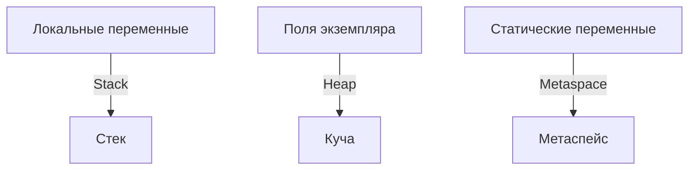

# Переменные в Java

> **Переменная** — это именованный контейнер в памяти, который хранит значение определенного типа (примитивного или ссылочного). 
> В Java переменные строго типизированы: их тип фиксируется при объявлении и не может быть изменён.
## Основные свойства переменной
- **Имя**: Уникальный идентификатор (например, `x`, `counter`).
- **Тип**: Определяет, какие данные могут храниться (например, `int`, `String`).
- **Значение**: Данные, хранимые в переменной.
- **Область видимости**: Где переменная доступна.
- **Время жизни**: Как долго переменная существует.
## Классификация переменных

### По месту объявления

#### Локальные переменные
- Объявляются внутри метода, конструктора или блока кода (`{}`).
- Хранятся в **стеке** JVM.
- Не инициализируются по умолчанию, требуют явного присваивания.
- Существуют только во время выполнения блока.

> **Пример:**
```java
void method() {
    int x = 10; // Локальная переменная
    System.out.println(x); // 10
} // x уничтожается при выходе из метода
```

#### Поля экземпляра (instance variables)
- Объявляются внутри класса, но вне методов, без `static`.
- Хранятся в **куче** (heap), внутри объекта.
- Автоматически инициализируются значениями по умолчанию (`0`, `null`, `false`).
- Существуют, пока жив объект.

> **Пример:**
```java
public class MyClass {
    int x; // Поле экземпляра
    public MyClass() {
        System.out.println(x); // 0 (по умолчанию)
        x = 20;
    }
}
```

#### Статические переменные (static variables)
- Объявляются внутри класса с ключевым словом `static`.
- Хранятся в **Metaspace** (Java 8+).
- Инициализируются значениями по умолчанию или при загрузке класса.
- Существуют, пока класс загружен в JVM.

```java
public class MyClass {
    static int counter = 0; // Статическая переменная
    public static void increment() {
        counter++;
    }
}
```
### По типу данных

#### Примитивные типы
- Хранят значение напрямую в памяти.
- Фиксированный размер, независимый от платформы.
- Типы: `byte`, `short`, `int`, `long`, `float`, `double`, `char`, `boolean`.

| Тип      | Размер   | Диапазон                | Значение по умолчанию |
|----------|----------|------------------------|----------------------|
| `byte`   | 1 байт   | -128..127              | 0                    |
| `short`  | 2 байта  | -32,768..32,767        | 0                    |
| `int`    | 4 байта  | -2^31..2^31-1          | 0                    |
| `long`   | 8 байт   | -2^63..2^63-1          | 0L                   |
| `float`  | 4 байта  | ~±3.4E38               | 0.0f                 |
| `double` | 8 байт   | ~±1.7E308              | 0.0                  |
| `char`   | 2 байта  | 0..65,535 (Unicode)    | '\u0000'             |
| `boolean`| 1 бит*   | true/false             | false                |
> *Реализация хранения `boolean` JVM-зависима.

```java
int number = 42;
char letter = 'A';
boolean flag = true;
```
#### Ссылочные типы
- Хранят ссылку на объект в куче.
- Включают классы (`String`, `List`), интерфейсы, массивы и пользовательские типы.
- Значение по умолчанию: `null`.

```java
String s = "Hello"; // s — ссылка на объект String
List<Integer> list = new ArrayList<>(); // list — ссылка на объект ArrayList
```
### По модификаторам

#### `final`

- Инициализируется один раз и не может быть переназначена.
- Для ссылочных типов фиксирует ссылку, но не содержимое объекта.
- Применяется к локальным переменным, полям экземпляра и статическим полям.

```java
final int x = 10;
// x = 20; // Ошибка компиляции
final List<String> list = new ArrayList<>();
list.add("Hello"); // Разрешено: изменяется содержимое объекта
// list = new ArrayList<>(); // Ошибка компиляции
```
#### `volatile`

- Обеспечивает видимость изменений переменной между потоками.
- Не гарантирует атомарность операций.

```java
public class SharedResource {
    volatile boolean flag = false;
    void setFlag() {
        flag = true; // Видно всем потокам
    }
}
```
#### `transient`

- Исключает поле из сериализации.
- При десериализации поле получает значение по умолчанию.

```java
public class User implements Serializable {
    private static final long serialVersionUID = 1L;
    String name;
    transient String password; // Не сериализуется
}
```

## Хранение и инициализация в JVM



| Вид переменной   | Где хранится | Инициализация по умолчанию | Жизненный цикл                |
|------------------|--------------|----------------------------|-------------------------------|
| Локальная        | Стек         | Нет (ошибка, если не инициализирована) | До выхода из метода/блока |
| Поле экземпляра  | Куча         | Да (0, null, false)        | Пока жив объект               |
| Статическая      | Metaspace    | Да (0, null, false)        | Пока загружен класс           |
```java
public class Example {
    int instanceVar; // 0
    static String staticVar; // null
    void method() {
        int localVar; // Не инициализирована
        // System.out.println(localVar); // Ошибка компиляции
    }
}
```

## Область видимости и жизненный цикл

### Область видимости

- **Локальные переменные**: Видимы только внутри блока, метода или конструктора.
- **Поля экземпляра**: Доступны через `this` внутри класса, если не ограничены модификаторами доступа.
- **Статические переменные**: Доступны через имя класса (`ClassName.var`) или `this` (в нестатическом контексте).

```java
public class ScopeExample {
    int instanceVar = 10;
    static int staticVar = 20;
    void method() {
        int localVar = 30;
        System.out.println(localVar); // 30
        System.out.println(this.instanceVar); // 10
        System.out.println(ScopeExample.staticVar); // 20
    }
}
```
### Жизненный цикл
- **Локальные переменные**: Уничтожаются при выходе из блока.
- **Поля экземпляра**: Уничтожаются, когда объект становится недоступным и собирается сборщиком мусора.
- **Статические переменные**: Уничтожаются при выгрузке класса из JVM (редко, обычно при завершении программы).
## Shadowing (Затенение переменных)

> **Shadowing** — ситуация, когда переменная во внутренней области видимости (например, параметр метода или локальная переменная) имеет то же имя, что и переменная во внешней области видимости (например, поле класса), и "затеняет" её.

```java
public class Person {
    String name = "Default";

    public void setName(String name) {
        this.name = name; // this ссылается на поле класса
    }

    //Java **не допускает** затенение локальных переменных в одной области видимости:
    void method() {
        int x = 10;
        {
            int x = 20; // Ошибка компиляции
        }
    }

    void method() {
        int i = 5;
        for (int i = 0; i < 10; i++) { // Ошибка: i уже определена до цикла
            System.out.println(i);
        }
    }

    //Shadowing в лямбда-выражениях
    void method() {
        String msg = "Hello";
        Runnable r = () -> {
            // String msg = "Hi"; // Ошибка
            System.out.println(msg); // OK
        };
    }
}
```
> **Совет:** Используйте разные имена или вложенные блоки.

---

## 6. Effectively Final

> **Effectively final** — переменная, которая не объявлена как `final`, но фактически не изменяется после инициализации. Важно для лямбда-выражений, анонимных и вложенных классов.

> **Зачем нужен effectively final?**
>
> Когда вы используете переменные из внешнего метода внутри лямбда-выражения или анонимного класса, Java требует, чтобы эти переменные не менялись после первого присваивания. Это нужно для безопасности и предсказуемости кода: лямбда может выполняться позже, в другом потоке, и если переменная изменится, результат будет неожиданным.
>
> **Просто:**
> - Если переменная не меняется после объявления — она effectively final, и её можно использовать в лямбде.
> - Если вы попытаетесь изменить её — компилятор выдаст ошибку.

```java
// effectively final
public void printMessage() {
    String msg = "Hello"; // Effectively final
    Runnable r = () -> System.out.println(msg); // OK
    r.run();
}
```

```java
// Нарушение effectively final
public void printMessage() {
    String msg = "Hello";
    msg = "Hi"; // Переприсваивание
    Runnable r = () -> System.out.println(msg); // Ошибка компиляции
}
```

---

## 7. Модификаторы доступа

- **`public`**: Доступна везде (в любом классе, пакете и модуле, если модуль экспортирует пакет).
- **`protected`**: Доступна в пакете, подклассах (даже в других модулях, если модуль экспортирует пакет).
- **`default` (package-private)**: Доступна только в пределах того же пакета и класса. Не видна вне пакета, даже если модуль экспортирует пакет.
- **`private`**: Доступна только внутри класса (и вложенных классов), не видна вне класса даже в том же пакете или модуле.

> **Доступность модификаторов в модулях (Java 9+):**
>
> | Модификатор   | Внутри класса | Внутри пакета | Внутри модуля | В других модулях (при экспорте) |
> |--------------|:-------------:|:-------------:|:-------------:|:-------------------------------:|
> | `public`     |      +        |      +        |      +        |               +                 |
> | `protected`  |      +        |      +        |      +        |        + (только в наследниках) |
> | package-private |   +        |      +        |      +        |               -                 |
> | `private`    |      +        |      -        |      -        |               -                 |

> **Пример:**
```java
public class AccessExample {
    public int publicVar = 1;
    protected int protectedVar = 2;
    int defaultVar = 3; // package-private
    private int privateVar = 4;
}
```
> **Заметка:** Модификаторы доступа применяются только к полям, но не к локальным переменным.

---

## 8. Переменные в многопоточной среде

### 8.1 Потокобезопасность
- **Локальные переменные**: Потокобезопасны, так как каждый поток имеет свой стек.
- **Поля экземпляра**: Не потокобезопасны, если объект используется несколькими потоками.
- **Статические переменные**: Не потокобезопасны, так как общие для всех экземпляров.

### 8.2 Использование `volatile`
- `volatile` обеспечивает видимость изменений переменной между потоками, но не атомарность.

> **Пример:**
```java
public class Counter {
    volatile int count = 0;
    void increment() {
        count++; // Не атомарно
    }
}
```
> **Решение:** Используйте `synchronized`, `AtomicInteger` или `Lock` для атомарности.

---

## 9. Внутренняя реализация в JVM
- **Стек**: Локальные переменные и ссылки хранятся в стеке каждого потока. Размер стека ограничен (`-Xss`).
- **Куча**: Объекты (включая поля экземпляра) хранятся в куче, разделённой на области (Young/Old Generation).
- **Metaspace**: Статические переменные и метаданные классов хранятся в Metaspace.
- **Сборка мусора**: Поля экземпляра удаляются, когда объект становится недоступным. Статические переменные живут до выгрузки класса.

> **Пример:**
```java
public class Example {
    static String staticField = "Static"; // Metaspace
    String instanceField = "Instance"; // Heap
    void method() {
        int localVar = 42; // Stack
    }
}
```

---

## 10. Подводные камни (чек-лист)

- [ ] **Неинициализированные локальные переменные**
    - Пример:
    ```java
    int x;
    // System.out.println(x); // Ошибка компиляции
    ```
    > **Решение:** Всегда инициализируйте локальные переменные.

- [ ] **Shadowing**
    - Пример:
    ```java
    String name = "Default";
    void setName(String name) {
        name = "New"; // Изменяет параметр, а не поле
    }
    ```
    > **Решение:** Используйте `this` для доступа к полям.

- [ ] **Злоупотребление `static`**
    - Статические переменные увеличивают потребление памяти, так как живут до выгрузки класса.
    > **Решение:** Используйте статические переменные только для общих данных.

- [ ] **Многопоточность**
    - Без `volatile` или синхронизации изменения переменной могут быть не видны другим потокам.
    > **Решение:** Используйте `volatile`, `synchronized` или атомарные классы.

- [ ] **Лямбда и effectively final**
    - Переменные, изменяемые после захвата в лямбде, вызывают ошибку.
    > **Решение:** Убедитесь, что переменные effectively final, или используйте массивы/объекты для обхода.

---

## 11. Комплексный пример использования переменных

> **Пример класса, иллюстрирующего работу с разными видами переменных, сериализацией, многопоточностью и лямбдами:**

```java
import java.io.Serializable;
import java.util.concurrent.atomic.AtomicInteger;

public class Counter implements Serializable {
    private static final long serialVersionUID = 1L;
    private static final AtomicInteger instanceCount = new AtomicInteger(0); // Статическая переменная
    private final String id; // Поле экземпляра, неизменяемое
    private transient int tempValue; // Не сериализуется
    private volatile boolean active = true; // Для многопоточности

    public Counter(String id) {
        this.id = id;
        instanceCount.incrementAndGet();
    }

    public void process() {
        int localCounter = 0; // Локальная переменная
        Runnable task = () -> {
            // localCounter = 1; // Ошибка: localCounter должен быть effectively final
            System.out.println("ID: " + id + ", Active: " + active);
        };
        task.run();
        localCounter++; // OK: не влияет на лямбду
    }

    public static int getInstanceCount() {
        return instanceCount.get();
    }

    public static void main(String[] args) {
        Counter c1 = new Counter("C1");
        Counter c2 = new Counter("C2");
        c1.process();
        System.out.println("Количество экземпляров: " + Counter.getInstanceCount());

        // Сериализация
        try (ObjectOutputStream oos = new ObjectOutputStream(new FileOutputStream("counter.ser"))) {
            oos.writeObject(c1);
        } catch (IOException e) {
            e.printStackTrace();
        }

        // Десериализация
        try (ObjectInputStream ois = new ObjectInputStream(new FileInputStream("counter.ser"))) {
            Counter restored = (Counter) ois.readObject();
            System.out.println("Восстановлено: " + restored.id + ", tempValue: " + restored.tempValue);
        } catch (IOException | ClassNotFoundException e) {
            e.printStackTrace();
        }
    }
}
```

> **Вывод:**
```
ID: C1, Active: true
Количество экземпляров: 2
Восстановлено: C1, tempValue: 0
```

---

# Вопросы для собеседования по переменным в Java

1. Что такое переменная в Java? Какие типы переменных существуют?
2. Чем отличается локальная переменная от поля класса?
3. Как работает инициализация переменных? Какие значения по умолчанию?
4. Что такое final переменные? Как они отличаются от обычных?
5. Как работает область видимости (scope) переменных в Java?
6. Что такое shadowing переменных? Как его избежать?
7. Как работает garbage collection для переменных?
8. Чем отличается примитивная переменная от ссылочной?
9. Как передаются переменные в методы? Что такое pass by value?
10. Что такое var в Java? Когда его использовать?
11. Как работает инициализация final переменных?
12. Что такое effectively final переменные?
13. Как работают переменные в лямбда-выражениях?
14. Что такое volatile переменные? Когда их использовать?
15. Как работают переменные в статических методах?
16. Что такое transient переменные? Для чего они нужны?
17. Как инициализируются переменные в конструкторе?
18. Что такое lazy initialization переменных?
19. Как работают переменные в анонимных классах?
20. Что такое thread-local переменные?
21. Как работает инициализация переменных в блоках?
22. Что такое constant переменные? Как их объявлять?
23. Как работают переменные в switch выражениях?
24. Что такое pattern matching для переменных?
25. Какие проблемы могут возникнуть при работе с переменными в многопоточности?