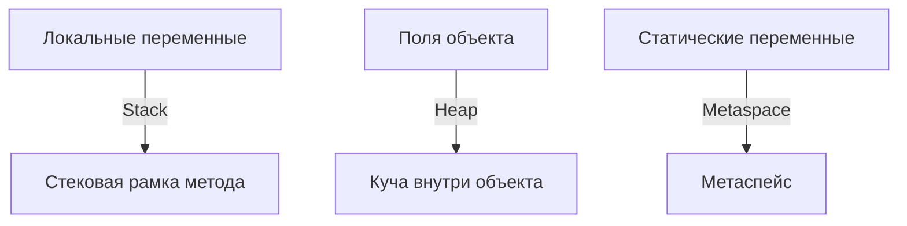

> **Примитивные типы** — это базовые строительные блоки для хранения данных в Java. В отличие от объектов:
> - Хранят значения напрямую, а не ссылки
> - Не имеют методов и не наследуются от `Object`
> - Не могут быть `null`
> - Используются для оптимизации памяти и производительности
## Классификация и таблица примитивных типов

Java поддерживает **8 примитивных типов**, которые можно разделить на группы:

| Группа | Тип | Размер (бит) | Диапазон значений | Значение по умолчанию |
|---|---|---|---|---|
| **Целочисленные** | `byte` | 8 | -128 .. 127 | 0 |
| | `short` | 16 | -32,768 .. 32,767 | 0 |
| | `int` | 32 | -2³¹ .. 2³¹-1 | 0 |
| | `long` | 64 | -2⁶³ .. 2⁶³-1 | 0L |
| **С плавающей точкой** | `float` | 32 | ±3.4 × 10³⁸ (6-7 знаков) | 0.0f |
| | `double` | 64 | ±1.8 × 10³⁰⁸ (15-16 знаков) | 0.0d |
| **Символьный** | `char` | 16 | 0 .. 65,535 (Unicode) | '\u0000' |
| **Логический** | `boolean` | 1 (логически, реализация JVM-зависима) | true / false | false |
> **Заметка:** Размеры типов фиксированы и не зависят от платформы благодаря стандартизации JVM.
## Хранение примитивных типов в JVM


### В стеке (Stack)
- **Локальные переменные** примитивных типов хранятся в стеке JVM (в стековой рамке метода).
- Переменные автоматически очищаются при выходе из метода.

```java
void method() {
    int x = 5; // Хранится в стеке
    double y = 3.14; // Хранится в стеке
} // x и y уничтожаются при выходе из метода
```
### В куче (Heap)
- Если примитив — **поле объекта**, он хранится в куче внутри объекта.

```java
class Example {
    int x = 42; // Хранится в куче как часть объекта
    double y = 3.14;
}
```
### В Metaspace
- **Статические переменные** (`static`) примитивных типов хранятся в Metaspace.
- Если переменная объявлена как `static final` и является константой, JVM может встраивать её значение в байт-код (инлайн).

```java
class Constants {
    static final int MAX_VALUE = 100; // Может быть встроено в байт-код
    static int counter = 0; // Хранится в Metaspace
}
```
## Особенности для каждого типа
### `boolean`

- Логически занимает 1 бит, но JVM использует минимум 1 байт для представления.
- В массивах `boolean[]` каждый элемент занимает 1 байт.
- Нет отдельной инструкции JVM для `boolean`; используется как `byte` или `int`.

```java
boolean flag = true;
boolean[] flags = new boolean[3]; // [false, false, false]
```
### `char`

- Единственный беззнаковый тип в Java.
- Хранит символы Unicode (16 бит, от `\u0000` до `\uFFFF`).

```java
char letter = 'A'; // Unicode: \u0041
char emoji = '😀'; // Unicode: \uD83D\uDE00 (суррогатная пара)
```
### `float` и `double`

- Следуют стандарту IEEE 754 для представления чисел с плавающей точкой.
- Имеют ограниченную точность, что может привести к ошибкам при сравнении.

```java
double a = 0.1;
double b = 0.2;
System.out.println(a + b == 0.3); // false (из-за погрешности)
```

> **Совет:** Используйте `BigDecimal` для точных вычислений.
### `byte`, `short`, `int`, `long`

- Знаковые типы, хранятся в формате **дополнительного кода** (two’s complement).
- Подходят для целочисленных вычислений.
## two’s complement

Дополнительный код — это способ представления отрицательных целых чисел в двоичной системе, который используется почти во всех современных компьютерах и языках программирования (в том числе в Java).

- Для положительных чисел двоичное представление обычное (например, 5 = 00000101 для byte).
- Для отрицательных чисел:
 1. Берём двоичное представление положительного числа (например, 5 = 00000101).
 2. Инвертируем все биты (получаем 11111010).
 3. Прибавляем 1 (получаем 11111011 — это -5 в дополнительном коде).

> - Нет двух нулей (как в некоторых других системах).
> - Арифметика работает "по кругу": если выйти за пределы диапазона, число перепрыгивает на противоположный край (например, 127 + 1 = -128 для byte).
> - Если число отрицательное, его двоичное представление — это "инверсия + 1" от положительного аналога.
> - Это позволяет компьютеру не задумываться, положительное число или отрицательное — сложение и вычитание всегда работают одинаково.
> - Позволяет процессору выполнять сложение, вычитание и другие арифметические операции одинаково для положительных и отрицательных чисел, без специальных условий. Упрощает схемы вычислений и ускоряет работу.

```java
byte b = -5; // Two’s complement: 11111011
int i = 1000000;
long l = 1234567890123L;
```
## Автобоксинг и анбоксинг

- **Автобоксинг** — автоматическое преобразование примитива в объект-обёртку (`int` → `Integer`).
- **Анбоксинг** — обратное преобразование (`Integer` → `int`).

> **Таблица соответствий:**

| Примитив | Обёртка |
|---|---|
| `byte` | `Byte` |
| `short` | `Short` |
| `int` | `Integer` |
| `long` | `Long` |
| `float` | `Float` |
| `double` | `Double` |
| `char` | `Character` |
| `boolean` | `Boolean` |

```java
int x = 5;
Integer boxed = x; // Автобоксинг
Integer boxed2 = Integer.valueOf(x); // То же самое явно

Integer boxed = 10;
int y = boxed; // Анбоксинг
int y2 = boxed.intValue(); // То же самое явно
```

### Внутренняя реализация и кэширование

- Автобоксинг вызывает `Type.valueOf(primitive)` (например, `Integer.valueOf(int)`).
- Анбоксинг вызывает `typeValue()` (например, `Integer.intValue()`).
- Для оптимизации `Integer`, `Byte`, `Short`, `Long`, `Character` кэшируют значения в диапазоне `-128..127`.

```java
Integer a = 100;
Integer b = 100;
System.out.println(a == b); // true (кэш)
Integer c = 1000;
Integer d = 1000;
System.out.println(c == d); // false (разные объекты)
```
### Производительность

- Создание обёртки требует выделения памяти в куче.
- Анбоксинг добавляет вызов метода (`intValue`, etc.).
- В циклах многократный автобоксинг/анбоксинг может замедлить выполнение.
- Частое создание обёрток увеличивает нагрузку на GC.

> **Совет:** Используйте примитивные потоки для коллекций:
```java
IntStream
	.range(0, 1000000)
	.forEach(list::add); // Без автобоксинга
```
## Подводные камни (чек-лист)

- [ ] **Автобоксинг и `NullPointerException`**
```java
Integer x = null;
int y = x; // NullPointerException
```

> **Решение:** Проверяйте на `null` перед анбоксингом.

- [ ] **Погрешности чисел с плавающей точкой**

```java
double x = 0.1 + 0.2;
System.out.println(x == 0.3); // false
```

> **Решение:** Используйте `BigDecimal` или сравнивайте с эпсилон.

- [ ] **Переполнение целочисленных типов**

```java
int max = Integer.MAX_VALUE;
int overflow = max + 1; // -2147483648
```

> **Решение:** Используйте `long` или проверяйте границы.

- [ ] **Кэширование обёрток**
```java
Integer a = 1000;
Integer b = 1000;
System.out.println(a == b); // false
```

> **Решение:** Используйте `equals()` для сравнения обёрток.
## Комплексный пример использования примитивов

> **Пример класса, иллюстрирующего работу с примитивами, массивами, потоками, сериализацией и точными вычислениями:**

```java
import java.io.*;
import java.math.BigDecimal;
import java.util.Arrays;
import java.util.concurrent.atomic.AtomicInteger;
import java.util.logging.Logger;
import java.util.stream.IntStream;

public class PrimitiveExample implements Serializable {
    private static final long serialVersionUID = 1L;
    private static final Logger LOGGER = Logger.getLogger(
	    PrimitiveExample.class.getName()
    );
    private static final int MAX_COUNT = 100; // Встраивается в байт-код
    private final int id;
    private transient double tempValue; // Не сериализуется
    private volatile boolean running = true;
    private static AtomicInteger instanceCount = new AtomicInteger(0);

    public PrimitiveExample(int id, double tempValue) {
        this.id = id;
        this.tempValue = tempValue;
        instanceCount.incrementAndGet();
    }

    public void process() {
        // Работа с примитивами
        int sum = IntStream
	        .range(0, MAX_COUNT)
	        .sum(); // Без автобоксинга
        LOGGER.info("Сумма: " + sum);

        // Проверка на переполнение
        if (id < Integer.MAX_VALUE) {
            LOGGER.info("ID: " + id);
        }

        // Многопоточность
        new Thread(() -> {
            while (running) {
                LOGGER.info("Поток активен, tempValue: " + tempValue);
                try {
                    Thread.sleep(100);
                } catch (InterruptedException e) {
                    LOGGER.severe("Ошибка потока: " + e.getMessage());
                }
            }
        }).start();

        // Точные вычисления
        BigDecimal bd = new BigDecimal(String.valueOf(tempValue));
        LOGGER.info("BigDecimal: " + bd);
    }

    public void stop() {
        running = false; // Видимо всем потокам
    }

    public static void main(String[] args) {
        PrimitiveExample example = new PrimitiveExample(42, 3.14);

        // Работа с массивом примитивов
        int[] numbers = new int[3];
        Arrays.fill(numbers, 10);
        LOGGER.info("Массив: " + Arrays.toString(numbers));

        // Вызов метода
        example.process();

        // Сериализация
        try (
	        ObjectOutputStream oos = new ObjectOutputStream(
		        new FileOutputStream("primitive.ser")
	        )
        ) {
            oos.writeObject(example);
            LOGGER.info("Объект сериализован");
        } catch (IOException e) {
            LOGGER.severe("Ошибка сериализации: " + e.getMessage());
        }

        // Десериализация
        try (
	        ObjectInputStream ois = new ObjectInputStream(
		        new FileInputStream("primitive.ser")
	        )
        ) {
            PrimitiveExample restored = (PrimitiveExample) ois.readObject();
            LOGGER.info(
	            "Десериализовано: id=" + restored.id + 
	            ", tempValue=" + restored.tempValue
            );
        } catch (IOException | ClassNotFoundException e) {
            LOGGER.severe("Ошибка десериализации: " + e.getMessage());
        }

        // Остановка потока
        example.stop();
    }
}
```

> **Предполагаемый вывод:**

```
INFO: Сумма: 4950
INFO: ID: 42
INFO: BigDecimal: 3.14
INFO: Массив: [10, 10, 10]
INFO: Поток активен, tempValue: 3.14
...
INFO: Объект сериализован
INFO: Десериализовано: id=42, tempValue=0.0
```
# Вопросы для собеседования по примитивным типам данных в Java

1. Какие примитивные типы данных поддерживает Java? Перечислите их с диапазонами значений.
2. Чем отличается int от Integer? Когда использовать примитивы, а когда объекты?
3. Как работает автобоксинг и анбоксинг в Java?
4. Что такое переполнение (overflow) и как его избежать?
5. Как работает арифметика с плавающей точкой? Почему 0.1 + 0.2 != 0.3?
6. Чем отличается float от double? Когда использовать каждый из них?
7. Как работает тип boolean? Какие значения он может принимать?
8. Что такое char в Java? Как он связан с Unicode?
9. Как происходит преобразование типов (type casting) в Java?
10. Что такое widening и narrowing conversion? Приведите примеры.
11. Как работает оператор instanceof с примитивными типами?
12. Что такое NaN, Infinity и -Infinity в контексте чисел с плавающей точкой?
13. Как проверить, является ли число NaN?
14. Как работает оператор % с отрицательными числами?
15. Что такое битовые операции? Как работают &, |, ^, ~, <<, >>, >>>?
16. Как работает сдвиг влево и вправо? В чём разница между >> и >>>?
17. Как оптимизировать работу с числами в Java?
18. Что такое BigDecimal и когда его использовать?
19. Как работает сравнение примитивных типов и их обёрток?
20. Какие особенности есть у типа long? Как работать с большими числами?
21. Как работает деление целых чисел? Что такое целочисленное деление?
22. Как округлить число с плавающей точкой до целого?
23. Что такое литералы в Java? Какие типы литералов поддерживаются?
24. Как работает оператор ?: с примитивными типами?
25. Какие проблемы могут возникнуть при работе с примитивными типами в многопоточности?
