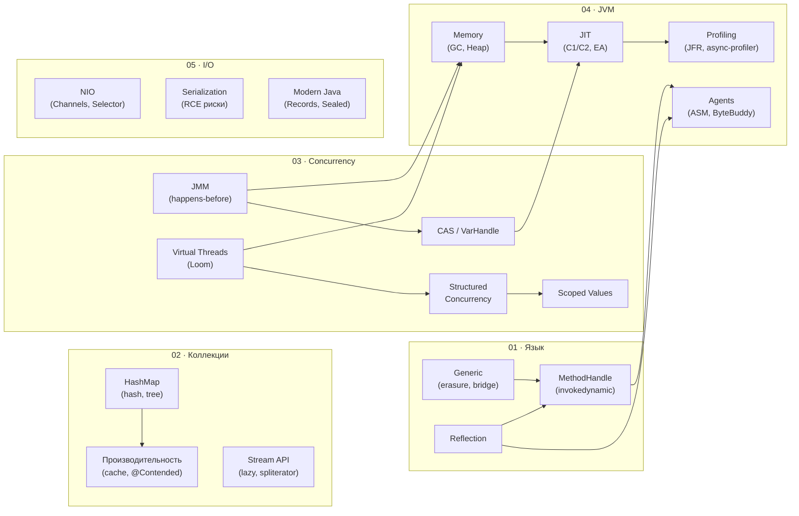

# Java — Центр Управления

> **Навигационный хаб.** Каждый раздел содержит уровни **Core** и **Deep Dive**, чеклист для самопроверки и таблицу файлов. Используй `Ctrl+Click` по wikilinks для перехода.

```
Base/Java/
├── 01_Language_and_OOP/      ← Синтаксис, ООП, Generics, Reflection
├── 02_Collections_and_Data/  ← Структуры данных, Stream API
├── 03_Concurrency_and_JMM/   ← Потоки, Locks, Loom, JMM
├── 04_JVM_Internals/         ← Memory, GC, JIT, Profiling, Agents
└── 05_Modern_Java_and_IO/    ← Java 9-21+, NIO, I/O, Serialization
```

---

## 01 · Язык и ООП

> **Папка:** `01_Language_and_OOP/`

### Самопроверка

**Core**
- [ ] Чем отличается `int` от `Integer`? Когда boxing вреден?
- [ ] Порядок инициализации: static блоки → instance блоки → конструктор при наследовании
- [ ] Перегрузка (overloading) vs Переопределение (overriding): что резолвится в compile-time, что в runtime?
- [ ] `==` vs `equals()` vs `hashCode()`: контракт и нарушения
- [ ] Модификаторы доступа: `private` / `package-private` / `protected` / `public`
- [ ] Wildcards: `? extends T` (PECS producer) vs `? super T` (consumer)
- [ ] Checked vs Unchecked исключения: когда что использовать?

**Deep Dive**
- [ ] Type erasure: почему нельзя `new T[]` и как это обходят?
- [ ] Bridge methods: зачем компилятор генерирует `ACC_BRIDGE + ACC_SYNTHETIC`?
- [ ] Virtual call в конструкторе — в чём опасность?
- [ ] `invokedynamic`: как лямбды превращаются в байт-код через `LambdaMetafactory`?
- [ ] `MethodHandle.invokeExact` vs `invoke` — разница в производительности и типах
- [ ] `VarHandle`: какие есть уровни memory ordering (plain / opaque / acquire-release / volatile)?

### Файлы раздела

| Файл | Уровень | Ключевые темы |
|---|---|---|
| [[Примитивные типы данных]] | Core | `byte/short/int/long`, автоупаковка, переполнение |
| [[Переменные]] | Core | Область видимости, `final`, shadowing |
| [[Массивы]] | Core | Хранение в heap, многомерные, `Arrays` утилиты |
| [[Условные операторы]] | Core | `switch` expressions (Java 14+), pattern matching |
| [[Циклы]] | Core | `for-each`, `break/continue` с label |
| [[Функции и методы]] | Core | Varargs, перегрузка, рекурсия |
| [[Java Assembling]] | Core | `.java` → `.class` → JVM, `javap -c` |
| [[Java Static]] | Core | static поля в Heap (Class mirror), `<clinit>` |
| [[Общее, поля, композиция классов, конструкторы, this, инициализаторы, модификаторы доступа, пакеты и импорты\|Классы и конструкторы]] | Core | `this()`, порядок инициализации |
| [[Инкапсуляция]] | Core | Сокрытие состояния, геттеры/сеттеры |
| [[Наследование]] | Core | `extends`, `super`, `@Override` |
| [[Полиморфизм]] | Core | Позднее связывание, vtable dispatch |
| [[Абстрактные классы]] | Core | Abstract vs Interface, когда что |
| [[Интерфейсы]] | Core | `default`, `static`, функциональные, `sealed` |
| [[Класс Object]] | Core | `equals`, `hashCode`, `toString`, `clone`, `wait/notify` |
| [[Вложенные и внутренние классы, builder паттерн для инициализации объектов\|Вложенные классы]] | Core | static nested, inner, local, anonymous |
| [[Инициализация объектов с учётом наследования]] | Core⚠️ | Порядок при наследовании, virtual call trap |
| [[Приведение типов, widening conversion, narrowing conversion\|Приведение типов]] | Core | `instanceof` pattern matching (Java 16+) |
| [[Enum]] | Core | Поля, методы, `EnumMap`, `EnumSet` |
| [[Java Generic]] | Core→Deep | PECS, type erasure, bridge methods |
| [[Java Exceptions]] | Core | Иерархия, `try-with-resources`, multi-catch |
| [[Java Reflection API]] | Deep | `setAccessible`, dynamic proxy, `Method.invoke` overhead |
| [[MethodHandle & LambdaMetafactory]] | Senior | `invokedynamic`, VarHandle memory ordering |

---

## 02 · Коллекции и данные

> **Папка:** `02_Collections_and_Data/`

### Самопроверка

**Core**
- [ ] Почему `ArrayList` быстрее `LinkedList` при итерации, несмотря на одинаковый O(n)?
- [ ] Как работает `HashMap` при коллизиях? Когда bucket становится деревом?
- [ ] Что такое `fail-fast` итератор и как его сломать (и починить)?
- [ ] `Stream` vs `Collection`: что ленивое, что не переиспользуемое?
- [ ] Разница между `map()` и `flatMap()`?

**Deep Dive**
- [ ] **Cache locality**: почему `int[]` × 1M быстрее `ArrayList<Integer>` × 1M в 5-10x?
- [ ] **False sharing** в `ConcurrentHashMap`: как `@Contended` решает проблему `LongAdder`?
- [ ] `HashMap.loadFactor=0.75`: как правильно инициализировать под известный размер?
- [ ] `EnumMap` vs `HashMap<Enum, V>`: почему `EnumMap` без hash?
- [ ] `Spliterator`: как он обеспечивает параллелизм в `parallelStream()`?

### Ключевое сравнение

| | ArrayList | LinkedList | ArrayDeque |
|---|---|---|---|
| Доступ по индексу | **O(1)** | O(n) | O(1) ends |
| Вставка в начало | O(n) | **O(1)** | **O(1)** |
| Вставка в конец | O(1)* | O(1) | **O(1)** |
| Cache locality | ✅ Отлично | ❌ Плохо | ✅ Хорошо |
| Память/элемент | ~4B (ref) | ~48B (node) | ~4B (ref) |
| Когда использовать | По умолчанию | Редко (замени ArrayDeque) | Queue/Stack |

| | HashMap | LinkedHashMap | TreeMap | EnumMap |
|---|---|---|---|---|
| get/put | O(1) avg | O(1) avg | O(log n) | **O(1)** |
| Порядок | ❌ | Insertion | Sorted | Enum ordinal |
| Память | Средняя | +prev/next ptr | +tree nodes | **Минимальная** |
| Когда | По умолчанию | Нужен порядок | Нужна сортировка | Enum ключи |

### Файлы раздела

| Файл | Уровень | Ключевые темы |
|---|---|---|
| [[Общая иерархия коллекций]] | Core | `Collection`, `Map`, `SequencedCollection` (Java 21) |
| [[Интерфейс List]] | Core | `ArrayList`, `LinkedList`, `CopyOnWriteArrayList` |
| [[Интерфейс Map]] | Core | `HashMap`, `TreeMap`, `ConcurrentHashMap` |
| [[Интерфейс Set]] | Core | `HashSet`, `TreeSet`, `EnumSet` |
| [[Интерфейсы Iterator и Iterable]] | Core | `Iterator`, `ListIterator`, fail-fast |
| [[Производительность коллекций]] | Core→Deep | Big-O, cache locality, `@Contended`, false sharing |
| [[Современные коллекции Java 9+]] | Core | `List.of()`, `Map.of()`, `Map.copyOf()` |
| [[Java Stream API]] | Core→Deep | Lazy eval, `Collectors`, `flatMap`, `reduce` |
| [[Функциональное программирование с коллекциями]] | Core | `Predicate`, `Function`, `Optional`, method refs |

---

## 03 · Многопоточность и JMM

> **Папка:** `03_Concurrency_and_JMM/`

### Самопроверка

**Core**
- [ ] 6 состояний потока: `NEW → RUNNABLE → BLOCKED/WAITING/TIMED_WAITING → TERMINATED`
- [ ] `synchronized` vs `volatile`: что гарантирует каждый?
- [ ] Happens-before: назови 5 базовых правил JMM
- [ ] Что такое CAS и ABA-проблема? Как решается через `AtomicStampedReference`?
- [ ] `ReentrantLock` vs `synchronized`: когда предпочесть Lock?
- [ ] Почему `CountDownLatch` одноразовый, а `CyclicBarrier` — нет?

**Deep Dive**
- [ ] **Double-Checked Locking**: почему сломан без `volatile`? Разобрать по байт-коду
- [ ] **False sharing**: как `LongAdder` использует `@Contended` для линейной масштабируемости?
- [ ] **VarHandle memory ordering**: разница acquire/release vs volatile — когда какой?
- [ ] **Virtual threads pinning**: почему `synchronized` блокирует carrier thread?
- [ ] `StructuredTaskScope.ShutdownOnFailure` vs `CompletableFuture.allOf()` — что лучше и почему?
- [ ] `ScopedValue` vs `ThreadLocal`: как наследование O(1) вместо O(n) копирования?

### Ключевое сравнение: Инструменты синхронизации

| Инструмент | Взаимоисключение | Условия | Прерываемость | Fairness | Виртуальные потоки |
|---|---|---|---|---|---|
| `synchronized` | ✅ | `wait/notify` | ❌ | ❌ | ⚠️ Pinning |
| `ReentrantLock` | ✅ | `Condition` | ✅ | ✅ opt | ✅ |
| `StampedLock` | ✅ + opt. read | ❌ | ✅ | ❌ | ✅ |
| `volatile` | ❌ | ❌ | — | — | ✅ |
| `Atomic*` | CAS only | ❌ | — | — | ✅ |
| `VarHandle` | CAS + ordering | ❌ | — | — | ✅ |

| Барьер | Одноразовый | Участники | Действие при достижении |
|---|---|---|---|
| `CountDownLatch` | ✅ | Любые | `countDown()` → `await()` разблокируется |
| `CyclicBarrier` | ❌ (reset) | Фиксированные | Все ждут, затем barrierAction |
| `Phaser` | ❌ | Динамические | Многофазный, register/deregister |
| `Semaphore` | ❌ | N permits | `acquire()` / `release()` |

> [!IMPORTANT] Виртуальные потоки и `synchronized`
> `synchronized` блок **пиннирует** виртуальный поток к carrier thread — виртуальный поток не может быть паркован и отдан другой задаче. При 10000 виртуальных потоков, стоящих в `synchronized`, carrier threads исчерпываются. **Решение:** заменить `synchronized` на `ReentrantLock` в коде, который будет запускаться с виртуальными потоками.

### Файлы раздела

| Файл | Уровень | Ключевые темы |
|---|---|---|
| [[Процессы и Потоки, Thread, Runnable, состояния потоков\|Потоки]] | Core | Thread lifecycle, `Thread.ofVirtual()`, Project Loom |
| [[Synchronized]] | Core | Monitor, biased → thin → fat lock, reentrant |
| [[wait(), notify(), notifyAll()]] | Core | Spurious wakeup, паттерн `while(!condition) wait()` |
| [[Атомарность операций и Volatile]] | Core | Видимость, happens-before, не-атомарность `++` |
| [[Прерывание потока в Java]] | Core | `interrupt()`, `isInterrupted()`, `InterruptedException` |
| [[Atomic]] | Core | `AtomicInteger`, `LongAdder` vs `AtomicLong` |
| [[CAS и Unsafe]] | Core→Deep | CAS механизм, ABA, VarHandle vs Unsafe |
| [[Lock]] | Core→Deep | `ReentrantLock`, `StampedLock`, `ReadWriteLock` |
| [[CountDownLatch]] | Core | Одноразовый барьер, fan-out паттерн |
| [[CyclicBarrier]] | Core | Многоразовый барьер, barrierAction |
| [[Phaser]] | Deep | Динамические участники, многофазность |
| [[Semaphore]] | Core | Ограничение конкурентного доступа |
| [[ThreadPool, Future, Callable, Executors, CompletableFuture\|ThreadPool & CompletableFuture]] | Core→Deep | `ExecutorService`, `CompletableFuture` chain |
| [[Модель памяти Java (JMM) и барьеры памяти]] | Deep | Happens-before rules, DCL, LoadLoad/StoreStore |
| [[Scoped Values (Java 21, JEP 446)]] | Senior | ScopedValue vs ThreadLocal, Spring Filter интеграция |
| [[Structured Concurrency]] | Senior | `StructuredTaskScope`, ShutdownOnFailure/Success |

---

## 04 · JVM Internals

> **Папка:** `04_JVM_Internals/`

### Самопроверка

**Core**
- [ ] Нарисуй карту памяти JVM: Heap (Eden/S0/S1/Old), Metaspace, Code Cache, Stack
- [ ] Разница между Minor GC, Mixed GC (G1), Full GC — когда каждый происходит?
- [ ] `ClassLoader` delegation: Bootstrap → Platform → Application → Custom
- [ ] Weak / Soft / Phantom Reference — когда GC удаляет каждую?
- [ ] `ThreadLocal` утечка в thread pool: почему и как предотвратить?

**Deep Dive**
- [ ] **ZGC Colored Pointers**: как 4 бита в указателе позволяют конкурентное перемещение?
- [ ] **G1 Evacuation Failure**: причины, "self-forwarded" объекты, как избежать Full GC?
- [ ] **Escape Analysis → Scalar Replacement**: когда JIT не создаёт объект в heap?
- [ ] **SafePoint Bias**: почему JVMTI профилировщик врёт и что делает async-profiler иначе?
- [ ] **Bridge Method + инструментирование**: как фильтровать `ACC_BRIDGE` в Java Agent?
- [ ] Tiered Compilation: что делает C1 vs C2? Зачем нужен профиль уровня 3?

### Ключевое сравнение: GC алгоритмы

| | G1 GC | ZGC | Shenandoah | Parallel GC |
|---|---|---|---|---|
| Production с | Java 9 | Java 15 | Java 15 | Java 1.1 |
| Паузы STW | 10–200ms | **< 1ms** | **< 1ms** | Высокие |
| Механизм | Evacuation | Colored Pointers + Load Barrier | Brooks Pointer | Stop-the-world |
| Heap | До ~100GB | **До TB** | ~100GB | Любой |
| CPU overhead | Низкий | Load barrier ~1-4% | +8B/obj ~2-5% | Минимальный |
| Когда | По умолчанию | Большой heap, < 1ms паузы | RedHat/OpenJDK | Batch, throughput |

> [!IMPORTANT] ZGC Load Barriers
> При каждом чтении ссылки из heap ZGC проверяет **colored bits** указателя (Mark0/Mark1/Remapped/Finalizable). Если биты «устаревшие» — `slowPath` исправляет адрес через relocation table. Это позволяет GC перемещать объекты **конкурентно**, пока приложение работает. Цена: ~1–4% throughput на load barriers.

### Файлы раздела

| Файл | Уровень | Ключевые темы |
|---|---|---|
| [[Java Memory Structure]] | Core→Deep | Heap regions, GC алгоритмы, TLAB, ZGC colored pointers |
| [[ClassLoaders]] | Core | Delegation model, `findClass()`, JPMS, утечки |
| [[Reference Types (Weak, Soft, Phantom)]] | Core | GC behaviour, `ReferenceQueue`, `Cleaner` API |
| [[JIT Compiler & Optimizations]] | Deep | C1/C2, Escape Analysis, Inlining, OSR, Deopt |
| [[JVM Profiling & Observability]] | Deep | JFR streaming, async-profiler, Heap Dump MAT |
| [[Java Agents & Instrumentation API]] | Senior | premain/agentmain, ASM, ByteBuddy, Bridge methods |

---

## 05 · Современный Java и I/O

> **Папка:** `05_Modern_Java_and_IO/`

### Самопроверка

**Core**
- [ ] `Record`: когда использовать вместо `@Data` (Lombok)? Ограничения?
- [ ] `Sealed` классы: как они усиливают `switch` pattern matching?
- [ ] `String` в Java 9+: что такое Compact Strings (LATIN1 vs UTF16)?
- [ ] `ByteBuffer.flip()` vs `compact()`: когда какой вызывать?
- [ ] `Selector`: почему нужно вручную удалять ключи из `selectedKeys()`?

**Deep Dive**
- [ ] **String Deduplication** (G1): как отличается от `String.intern()`? Когда применять?
- [ ] **Zero-copy `transferTo()`**: сколько копий данных при обычной vs zero-copy передаче файла?
- [ ] **Deserialization RCE**: как работает гаджет-цепочка? Что такое `ObjectInputFilter`?
- [ ] `invokedynamic` + `StringConcatFactory`: почему конкатенация строк в Java 9+ быстрее?
- [ ] `ScopedValue` + Spring `Filter`: как правильно обернуть весь HTTP request в scope?

### Ключевое сравнение: I/O подходы

| | Old I/O | NIO (Channels) | NIO2 (Files/Path) | Async NIO |
|---|---|---|---|---|
| Модель | Blocking | Non-blocking (Selector) | Blocking (удобный API) | Completion handlers |
| Потоки | 1/соединение | 1 на N соединений | 1/операция | Thread pool |
| Буфер | Stream (нет) | `ByteBuffer` | `byte[]` / `String` | `ByteBuffer` |
| Когда | Legacy | High-concurrency servers | Файловые операции | Windows IOCP |
| Frameworkи | — | Netty, Tomcat NIO | Spring `Resource` | — |

> [!IMPORTANT] Deserialization RCE — вектор атаки
> `ObjectInputStream.readObject()` вызывает `resolveClass()` → `Class.forName()` → затем `readObject()` каждого вложенного объекта. Если в classpath есть Apache Commons Collections ≤ 3.2.1, атакующий передаёт payload с цепочкой `LazyMap → InvokerTransformer → Runtime.exec()`. **Защита:** `ObjectInputFilter` белый список классов + никогда не десериализовать из недоверенных источников.

### Файлы раздела

| Файл | Уровень | Ключевые темы |
|---|---|---|
| [[Современные возможности Java]] | Core | Records, Sealed, Pattern matching, `var`, Text blocks |
| [[Java String]] | Core→Deep | String Pool, Compact Strings, Deduplication, `intern()` |
| [[Java Date and Time]] | Core | `LocalDate/Time`, `ZonedDateTime`, `DateTimeFormatter` |
| [[Java Input-Output]] | Core | `InputStream/OutputStream`, `BufferedReader`, NIO.2 Path |
| [[Java Serialization and Deserialization]] | Core⚠️ | `Serializable`, `transient`, RCE уязвимости, `ObjectInputFilter` |
| [[NIO Networking]] | Deep | Channels, Selector event loop, zero-copy `transferTo()`, mmap |

---

## Быстрая навигация по уровням

### Core — фундамент (Junior → Middle)
[[Примитивные типы данных]] · [[Java Generic]] · [[Java Exceptions]] · [[Общая иерархия коллекций]] · [[Интерфейс Map]] · [[Java Stream API]] · [[Процессы и Потоки, Thread, Runnable, состояния потоков|Потоки]] · [[Synchronized]] · [[Атомарность операций и Volatile]] · [[ThreadPool, Future, Callable, Executors, CompletableFuture|CompletableFuture]] · [[Java Memory Structure]] · [[ClassLoaders]] · [[Современные возможности Java]]

### Deep Dive — от Middle к Senior
[[Java Reflection API]] · [[Производительность коллекций]] · [[CAS и Unsafe]] · [[Lock]] · [[Модель памяти Java (JMM) и барьеры памяти]] · [[JIT Compiler & Optimizations]] · [[JVM Profiling & Observability]] · [[NIO Networking]] · [[Java Serialization and Deserialization]]

### Senior — экспертный уровень
[[MethodHandle & LambdaMetafactory]] · [[Scoped Values (Java 21, JEP 446)]] · [[Structured Concurrency]] · [[Java Agents & Instrumentation API]]

---

## Карта зависимостей тем


